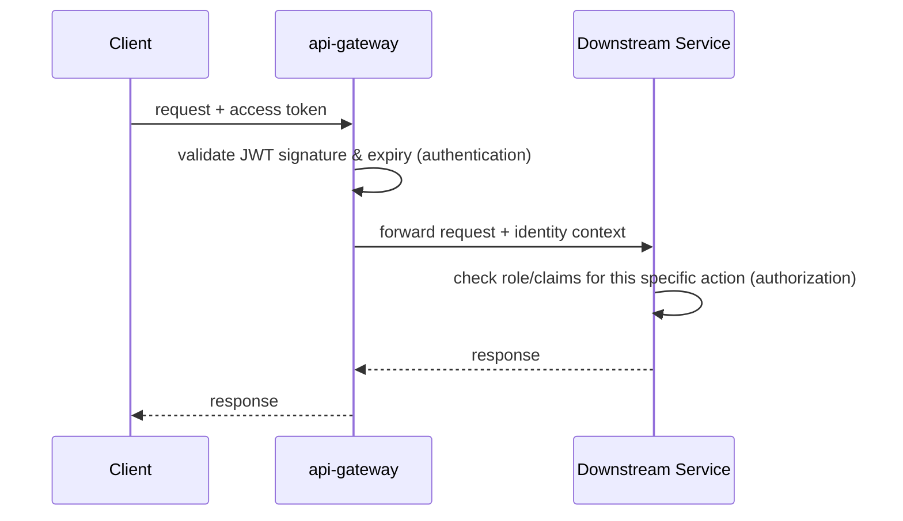

# Authentication Flow

## Scope

Covers registration, login, JWT issuance, refresh, authorization enforcement, logout/revocation, and how identity propagates to service-to-service calls. Owned entirely by `auth-service`; every other service consumes its output (a validated identity) but never re-implements authentication.

## Actors

Traveler, Bus Operator, Platform Admin, and Support Agent all authenticate through the same `auth-service` — they are differentiated by a role claim in the token, not by separate authentication systems. This keeps `auth-service` a single hardened surface instead of three.

## Registration & Login

1. Client submits credentials (email/phone + password, or an OTP challenge) to `auth-service` via `api-gateway`.
2. `auth-service` validates credentials against its own store (owned exclusively by `auth-service` — see `database-ownership.md`).
3. On success, `auth-service` issues two tokens:
   - a short-lived **access token** (JWT)
   - a longer-lived **refresh token**

## Token Design

| Token | Lifetime | Purpose |
|---|---|---|
| Access token | Short (minutes) | Presented on every API call; stateless, self-contained |
| Refresh token | Long (days) | Used only to obtain a new access token; can be revoked server-side |

Conceptual claims carried in the access token: subject (user ID), role, issued-at, expiry. Exact claim schema is an implementation decision, not an architecture decision.

**Trade-off — short vs. long access-token lifetime:** a shorter access token reduces the exposure window if a token leaks, at the cost of more frequent refresh calls. A longer one reduces refresh traffic but widens the exposure window. Phase 1 favors short-lived access tokens (minutes) plus revocable refresh tokens — the safer default for a platform handling payments, accepting the extra refresh traffic as a reasonable cost.

## Refresh Flow

1. Client's access token expires (or is about to).
2. Client calls `auth-service`'s token-refresh endpoint with the refresh token.
3. `auth-service` validates the refresh token is not expired and not revoked.
4. `auth-service` issues a new access token **and rotates the refresh token** (the old one is invalidated as part of issuing the new one).

**Why rotate on every refresh:** refresh-token rotation means a stolen refresh token can be used at most once before the legitimate client's next refresh fails and reveals the theft (the old token no longer works for either party) — this is the standard mitigation against long-lived refresh tokens being a high-value theft target.

## Authorization / Request Flow

`api-gateway` is trusted for **authentication** (is this a validly-signed, unexpired token) but not for **authorization** (is this identity allowed to do this specific thing) — that decision is made independently by the owning service. This is deliberate defense-in-depth: a misconfigured gateway routing rule should never be the only thing standing between a traveler-scoped token and an admin-only action.

## Logout & Revocation

- Refresh tokens are revocable: `auth-service` maintains a fast revocation check (Redis-backed, for low-latency lookup) so logout takes effect immediately for future refresh attempts.
- Access tokens are **not** individually revocable — they are stateless JWTs by design.

**Trade-off — stateless JWT vs. per-request revocation check:** checking every access token against a revocation list on every request would make logout/ban instantaneous, but adds a lookup to the hot path of *every single API call* across the platform. Phase 1 accepts a short window (the access token's remaining lifetime, minutes) where a logged-out or banned user's access token could theoretically still work, in exchange for zero added latency on the common case. This is why the access-token lifetime is kept short — it's the actual bound on this exposure window.

## Service-to-Service Calls

Internal calls (e.g., `booking-service` → `inventory-service`) do not go through a full login flow. They rely on the platform's private network boundary (internal cluster network, not internet-reachable) and propagate the original caller's identity/claims where the downstream service needs to know "on behalf of whom" this call is being made (e.g., an operator-scoped write must still be checked against that operator's own data). Mutual TLS between services is a reasonable future hardening step once the platform runs on Kubernetes, but is not designed here — Phase 1 relies on network-boundary trust plus claim propagation.
