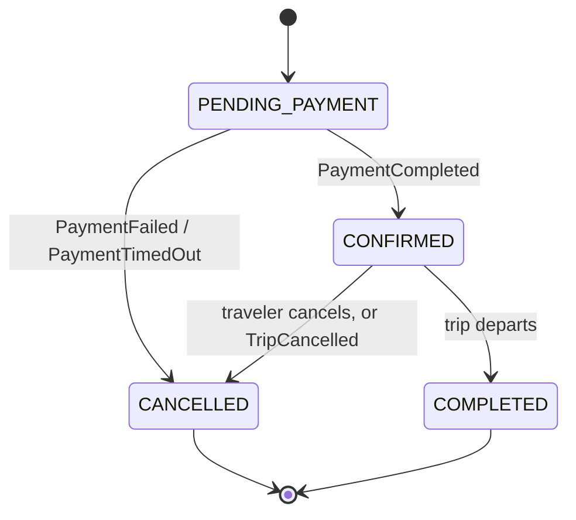

# Booking Flow

## Scope

The complete booking lifecycle, from seat selection through trip completion, at the system-interaction level. `user-journeys.md` describes this from the traveler's point of view; this document describes it from the services' point of view — who calls whom, synchronously or asynchronously, and why.

## Booking States

`booking-service` owns this state machine exclusively — no other service mutates a booking's state.

## Lifecycle, Step by Step

1. **Seat selection & hold.** The client (via `api-gateway`) calls `inventory-service` directly to create a seat hold, receiving a hold token and TTL. `inventory-service` owns availability and holds — see `service-boundaries.md` — so this is not routed through `booking-service`.
2. **Booking creation.** The client calls `booking-service` to create a booking, passing the hold token and passenger details. `booking-service` **synchronously validates the hold** with `inventory-service` (a read call) before persisting a booking in `PENDING_PAYMENT` state, then emits `BookingCreated` (analytics only — see `event-catalog.md`).
   - **Why a synchronous validation call instead of waiting for the `SeatHeld` event:** an event-driven check would create a race where the client could reach `booking-service` before it has consumed the corresponding event. Correctness-critical checks use a direct call; the event exists only for downstream systems that don't need it in real time.
3. **Payment initiation.** The client calls `payment-service` to initiate payment against the `PENDING_PAYMENT` booking. See `payment-flow.md` for what happens inside `payment-service`.
4. **Outcome — success.** `payment-service` emits `PaymentCompleted`. `booking-service` consumes it, transitions the booking to `CONFIRMED`, and emits `BookingConfirmed`. `inventory-service` consumes `BookingConfirmed` and converts the still-active hold into a permanent seat allocation. `notification-service` sends the confirmation.
   - **Why the hold-to-reservation conversion is asynchronous, safely:** the hold's TTL is deliberately set longer than the maximum acceptable payment-processing time, so by the time `PaymentCompleted` is even possible, the hold is guaranteed to still be active — there is no window where the seat could be taken by someone else between booking confirmation and hold conversion.
5. **Outcome — failure or timeout.** `payment-service` emits `PaymentFailed` or `PaymentTimedOut`. `booking-service` transitions the booking to `CANCELLED` (reason recorded) and emits `BookingCancelled`. `inventory-service` releases the hold if it hasn't already expired on its own.
6. **Traveler-initiated cancellation (post-confirmation).** `booking-service` checks the applicable cancellation policy via a synchronous call to `operator-service`, transitions `CONFIRMED → CANCELLED`, emits `BookingCancelled`, which triggers a seat release in `inventory-service` and a refund request to `payment-service` (see `payment-flow.md`).
7. **Operator-initiated trip cancellation.** On `TripCancelled`, `booking-service` finds every `CONFIRMED` booking for that trip and cancels each one. Unlike a traveler-initiated cancellation, this is a **full refund regardless of the trip's normal cancellation-fee policy** — the traveler didn't cause the cancellation, so the standard fee schedule doesn't apply. This is a deliberate business rule, not a technical default.
8. **Trip completion.** A scheduled system job (see `actors.md` — Scheduler/System Jobs) marks `CONFIRMED` bookings as `COMPLETED` once their trip's departure time has passed, making them eligible for review (FR-7.2).

## Idempotency

A hold token can become at most one booking. Booking creation is idempotent with respect to the hold token — a duplicate submission (e.g., a client retry after a network blip) must not create a second booking for the same hold. This is enforced as a uniqueness constraint at the domain level; the exact mechanism is a `booking-service` implementation decision, not designed here.

## Why `booking-service` Doesn't Own Seat Allocation

This is the central boundary decision behind this whole flow, detailed in `service-boundaries.md`: keeping allocation mechanics inside `inventory-service` means `booking-service` never needs to understand locking, contention, or Redis — it only needs to know "is this hold valid" and "confirm/release it." The cost is an extra service hop per booking; the benefit is that the highest-contention code (seat locking) stays isolated and independently scalable, and `booking-service` stays simple enough to reason about as a pure state machine.
