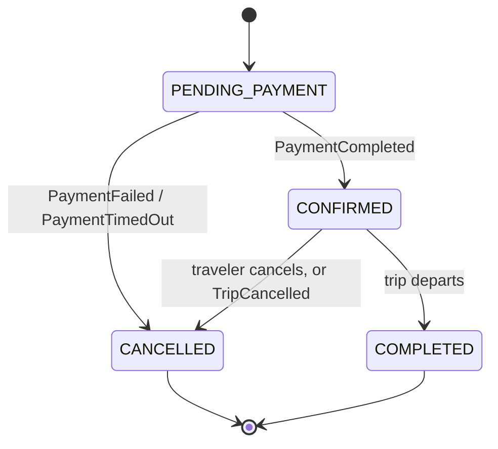

# Booking Flow

> **Corrected by architecture review, 2026-07-22.** Live seat availability, holds, and
> reservations moved from `inventory-service` to `provider-integration-service`
> (`docs/services/inventory-service/overview.md`). This document's step 1, 4, 5, 6, and 7 are
> updated accordingly; the state machine and payment coordination are otherwise unchanged.

## Scope

The complete booking lifecycle, from seat selection through trip completion, at the system-interaction level. `user-journeys.md` describes this from the traveler's point of view; this document describes it from the services' point of view — who calls whom, synchronously or asynchronously, and why.

## Booking States

`booking-service` owns this state machine exclusively — no other service mutates a booking's state.

## Lifecycle, Step by Step

1. **Seat selection & hold.** The client (via `api-gateway`) calls `booking-service`, which first
   resolves the trip's catalog metadata and `ProviderMapping` from `inventory-service`, then calls
   `provider-integration-service` to authenticate/reuse a provider session and block the selected
   seat(s), receiving a provider reservation reference and TTL. **`inventory-service` is not in
   this call chain for the hold itself** — it already answered the metadata/mapping question a
   step earlier (see `docs/services/inventory-service/sequence-diagrams.md` §4–5). This corrects
   the previous version of this document, which had the client calling `inventory-service` directly
   for this step, back when `inventory-service` owned holds.
2. **Booking creation.** The client calls `booking-service` to create a booking, passing the
   provider reservation reference and passenger details. `booking-service` **synchronously
   validates the reservation** with `provider-integration-service` (a read call) before persisting
   a booking in `PENDING_PAYMENT` state, then emits `BookingCreated` (analytics only — see
   `event-catalog.md`).
   - **Why a synchronous validation call instead of waiting for an event:** an event-driven check would create a race where the client could reach `booking-service` before it has consumed the corresponding event. Correctness-critical checks use a direct call; any event exists only for downstream systems that don't need it in real time.
3. **Payment initiation.** The client calls `payment-service` to initiate payment against the `PENDING_PAYMENT` booking. See `payment-flow.md` for what happens inside `payment-service`.
4. **Outcome — success.** `payment-service` emits `PaymentCompleted`. `booking-service` consumes
   it, calls `provider-integration-service` to **confirm the booking with the provider**
   (converting the still-active reservation into a confirmed booking), then transitions the
   RoadScanner booking to `CONFIRMED` and emits `BookingConfirmed`. `notification-service` sends
   the confirmation.
   - **Why the reservation is still guaranteed active at this point:** the reservation's TTL is deliberately set longer than the maximum acceptable payment-processing time, so by the time `PaymentCompleted` is even possible, the reservation is guaranteed to still be active — there is no window where the seat could be taken by someone else between payment success and provider confirmation.
   - **Edge case — provider confirmation fails after payment already succeeded.** Rare (the TTL discipline above is designed to make it unreachable in the common case), but possible with a third-party provider — a late-arriving provider-side rejection, an expired block despite the TTL margin, or a provider outage at exactly the wrong moment. `booking-service` must never leave a booking `CONFIRMED` against a seat the provider didn't actually confirm. This must trigger an **automatic refund** and a support-visible flag, the same "never silently keep the traveler's money" rule `payment-flow.md` already applies to its own late-success edge case — this is a required reconciliation path, not a rare exception to hand-wave.
5. **Outcome — failure or timeout.** `payment-service` emits `PaymentFailed` or `PaymentTimedOut`. `booking-service` transitions the booking to `CANCELLED` (reason recorded) and emits `BookingCancelled`, and calls `provider-integration-service` to release the seat reservation if it hasn't already expired on its own.
6. **Traveler-initiated cancellation (post-confirmation).** `booking-service` checks the applicable cancellation policy via a synchronous call to `operator-service`, transitions `CONFIRMED → CANCELLED`, emits `BookingCancelled`, and requests a refund from `payment-service` (see `payment-flow.md`).
   - **Open gap, flagged by architecture review, not resolved here:** reversing an *already-confirmed* booking with a third-party provider has no corresponding capability in `provider-integration-service`'s current port set (`AuthenticateProvider`/`SearchTrips`/`GetSeatMap`/`BlockSeat`/`ReleaseSeat`/`ConfirmBooking`/`DownloadTicket` — no `CancelBooking`). `ReleaseSeat` only covers a still-`BLOCKED`, not-yet-confirmed reservation. This needs a design decision (a new `provider-integration-service` inbound port, or an accepted policy that post-confirmation cancellations are refund-only with no provider-side reversal) before this step can be implemented — see the architecture review notes for `docs/services/inventory-service/`.
7. **Operator-initiated trip cancellation.** On `TripCancelled`, `booking-service` finds every `CONFIRMED` booking for that trip and cancels each one. Unlike a traveler-initiated cancellation, this is a **full refund regardless of the trip's normal cancellation-fee policy** — the traveler didn't cause the cancellation, so the standard fee schedule doesn't apply. This is a deliberate business rule, not a technical default. Same open gap as step 6 applies to any provider-side reversal this cascade would otherwise attempt.
8. **Trip completion.** A scheduled system job (see `actors.md` — Scheduler/System Jobs) marks `CONFIRMED` bookings as `COMPLETED` once their trip's departure time has passed, making them eligible for review (FR-7.2).

## Idempotency

A hold token can become at most one booking. Booking creation is idempotent with respect to the hold token — a duplicate submission (e.g., a client retry after a network blip) must not create a second booking for the same hold. This is enforced as a uniqueness constraint at the domain level; the exact mechanism is a `booking-service` implementation decision, not designed here.

## Why `booking-service` Doesn't Own Seat Allocation

This is the central boundary decision behind this whole flow, detailed in `service-boundaries.md`: keeping locking/reservation mechanics inside `provider-integration-service` means `booking-service` never needs to understand provider-specific APIs, locking, contention, resilience, or Redis — it only needs to know "is this reservation valid" and "confirm/release it" through one canonical port. The cost is an extra service hop per booking; the benefit is that the highest-contention, highest-volatility code (seat state) stays isolated and independently scalable, and `booking-service` stays simple enough to reason about as a pure state machine that composes catalog facts (`inventory-service`) with live provider actions (`provider-integration-service`).
