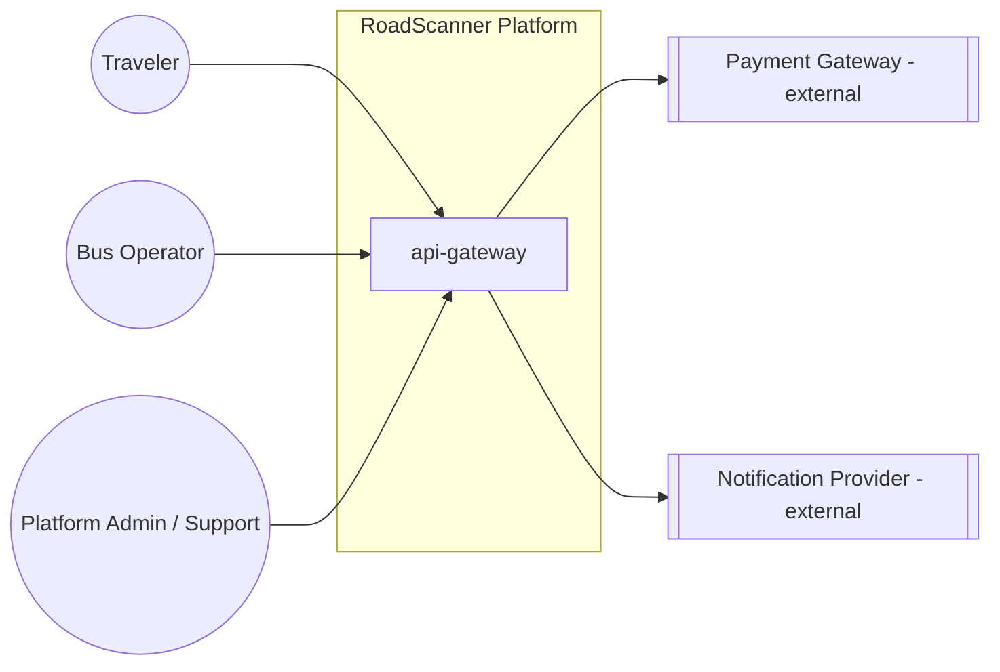
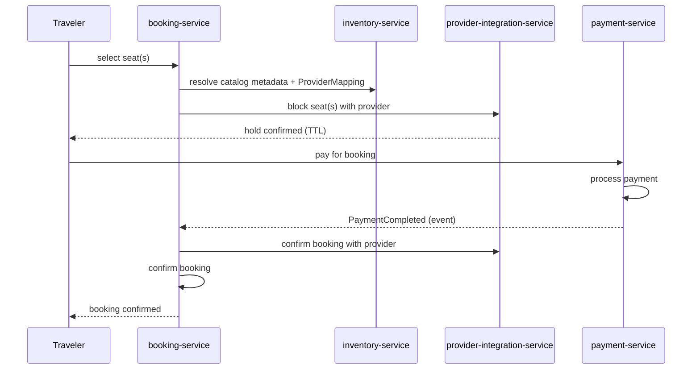

# High-Level Design

This document is the architectural blueprint for RoadScanner Phase 1 (Bus Booking). It describes system structure and behavior, not implementation. It complements — and does not restate — `.claude/ARCHITECTURE_RULES.md`, which remains the enforced source of truth for engineering rules; this document explains how those rules apply concretely to this platform.

## 1. Architecture Style

- **Microservices** — one deployable service per bounded context, independently releasable.
- **Domain-Driven Design** — service boundaries follow business subdomains (Search, Booking, Payment, ...), not technical layers.
- **Clean / Hexagonal Architecture within each service** — domain logic is isolated from delivery mechanisms (REST, Kafka) and infrastructure (database, cache) behind ports and adapters.
- **Event-driven** — cross-service consistency is achieved through Kafka events, not synchronous chains or shared databases.
- **SOLID** at the code level, enforced at review time.

## 2. System Context

`api-gateway` is the single entry point for every client. No client — including internal admin tooling — talks to a backend service directly.

## 3. Service Inventory & Responsibilities

| Service | Responsibility | Owns (data) | Primary Actors |
|---|---|---|---|
| `api-gateway` | Routing, JWT validation, rate limiting | none (stateless) | all |
| `auth-service` | Authentication, JWT issuance/rotation, identity | Credentials, sessions | Traveler, Operator, Admin |
| `user-service` | Traveler profile & account data | Traveler profiles, saved passengers | Traveler |
| `operator-service` | Operator accounts, fleets, routes | Operator profile, fleet, route definitions | Operator, Admin |
| `inventory-service` | Catalog & metadata — cities, stations, routes, trips, seat layouts, provider mappings, sync | Cities, stations, routes, trip metadata, seat layouts, provider mappings, fare snapshots | Operator, Traveler (indirect) |
| `search-service` | Trip search & ranking | Search index (derived read model) | Traveler |
| `booking-service` | Booking lifecycle & state machine, seat-selection orchestration | Bookings, tickets | Traveler, Operator |
| `payment-service` | Payment processing, refunds, ledger | Payment transactions, refunds | Traveler, Operator |
| `notification-service` | Email/SMS/push delivery | Notification templates/log | all |
| `analytics-service` | Event ingestion, reporting/BI | Aggregated events | Admin |
| `review-service` | Ratings & reviews | Reviews | Traveler |
| `provider-integration-service` | Sole gateway to external transportation providers (FlixBus first); owns live seat availability, holds, and reservations | Provider configs, sessions, live seat state, audit trail, health | none directly — internal-only, called by `booking-service`/`search-service`/`inventory-service` |

This matches `backend/services/` exactly. `provider-integration-service` is this document's one
addition since Phase 1 planning — see `docs/services/provider-integration-service/overview.md`
for why it exists as its own service rather than being folded into an existing one.
`inventory-service`'s responsibility was corrected by architecture review, 2026-07-22 — it
previously listed live availability and seat holds as its own; those now belong to
`provider-integration-service`, and `inventory-service` is catalog/metadata only. See
`docs/services/inventory-service/overview.md`.

## 4. Data Ownership

Each service owns its own database; **no service reads another service's database directly.** Where a service needs data it doesn't own, it either:

- calls the owning service's API synchronously, or
- maintains its own derived read model, kept current via Kafka events (e.g., `search-service`'s index is a read model built from `inventory-service`'s merged-catalog events — see `docs/services/inventory-service/overview.md` for why `inventory-service`, not `operator-service` directly, is the producer).

This is a hard rule, not a guideline — it's what keeps 12 services independently deployable without a shared-schema migration ever blocking a release.

## 5. Communication Patterns

- **Synchronous (REST, via `api-gateway`)** — client-facing request/response: search a route, view a trip, initiate a booking action.
- **Asynchronous (Kafka)** — cross-service consistency and decoupling. High-level event catalog (not a schema — see `docs/api/` once services exist):

  | Event | Producer | Consumers |
  |---|---|---|
  | `TripPublished` / `TripUpdated` (first-party) | `operator-service` | `inventory-service` |
  | `TripPublished` / `TripUpdated` (merged catalog) | `inventory-service` | `search-service` |
  | `SeatBlocked` / `SeatReleased` | `provider-integration-service` | `booking-service`, `analytics-service` |
  | `BookingCreated` / `BookingCancelled` | `booking-service` | `notification-service`, `analytics-service` (see `event-catalog.md` — the provider-side release on cancellation is now a synchronous call, not event-triggered) |
  | `PaymentCompleted` / `PaymentFailed` / `RefundIssued` | `payment-service` | `booking-service`, `notification-service`, `analytics-service` |
  | `ReviewSubmitted` | `review-service` | `search-service`, `analytics-service` |

  See `event-catalog.md` for the full catalog, including `RouteUpdated`, `OperatorUpdated`,
  `FareSnapshotUpdated`, `CatalogSyncCompleted`/`Failed` (all `inventory-service`), and
  `ProviderUnavailable`/`ProviderRecovered`/`SessionExpired` (`provider-integration-service`).

`api-gateway` never produces or consumes Kafka events — it is purely the synchronous front door.

## 6. Booking Consistency (the critical path)

Booking and payment are the one place where strong consistency matters more than availability — per NFR-7, a lost payment or a double-booked seat is unacceptable.

If payment fails, `payment-service` emits `PaymentFailed`; `booking-service` never confirms the booking, and calls `provider-integration-service` to release the reservation (or lets it expire on its own TTL) — the seat is never lost to a booking that didn't happen. See `docs/architecture/booking-flow.md` (corrected by architecture review, 2026-07-22) for the full step-by-step, including the new edge case where a provider declines confirmation after payment already succeeded.

This is implemented as a **saga** across `booking-service` and `payment-service`, with each service using a **transactional outbox** (the DB write and its corresponding Kafka event commit atomically) so there is no window where a service's own state and its published event can disagree. This operationalizes the "Future: Saga Pattern, Outbox Pattern" line in `.claude/ARCHITECTURE_RULES.md` — adopted specifically for the booking↔payment path, not applied platform-wide, because most other flows tolerate eventual consistency.

## 7. Caching Strategy (Redis)

- **Search/availability** — short-TTL cache in front of `search-service` reads, and in front of `provider-integration-service`'s own live provider calls (`ProviderCache`), to absorb read-heavy load without hitting a provider or Postgres on every search.
- **Seat holds** — owned by `provider-integration-service`, not `inventory-service` (corrected by architecture review, 2026-07-22 — see `docs/architecture/seat-locking-flow.md`). TTL-based locks are a natural fit for Redis wherever RoadScanner itself is the system of record for a hold; for a third-party provider, the provider's own system is authoritative and `provider-integration-service` relays rather than locks — see `seat-locking-flow.md` for the distinction.
- **Provider sessions/tokens** — short-TTL cache in `provider-integration-service`, source of truth in its own Postgres.
- **Sessions / rate limiting** — at `api-gateway`.

Redis is always a derived, expendable copy. If it's flushed, the platform degrades in latency, not correctness — the database remains the source of truth everywhere.

## 8. Security Architecture

- `auth-service` issues JWTs; `api-gateway` validates them on every client-facing call.
- Downstream services re-validate the token (or a signed internal equivalent) at their own boundary for **authorization** — the gateway is trusted for authentication, not for a downstream service's access-control decisions.
- Roles (traveler / operator / admin / support) are encoded as JWT claims and enforced per-service.
- Payment data never enters RoadScanner's own database — `payment-service` stores only gateway references and status (NFR-12).

## 9. Observability

- Every service ships with a health endpoint, Prometheus metrics, and an OpenAPI spec from its first deployable commit (NFR-15) — this is a definition-of-done item, not a follow-up task.
- A correlation/trace ID is issued at `api-gateway` and propagated through every downstream synchronous call and Kafka event, so one customer-facing request is traceable end-to-end (NFR-16).
- Logs are structured and centralized in Loki; Grafana dashboards cover per-service health and key business events (bookings, payments, cancellations).

## 10. Deployment Topology

- Each service is an independent container image with its own build/deploy pipeline (`.github/workflows`), deployable without coordinating a platform-wide release.
- Three environments — dev / staging / prod — mirrored across `infrastructure/terraform/environments` and `infrastructure/kubernetes/overlays`.
- Kubernetes is the target production runtime (future milestone). Local development uses Docker Compose (`docker/`), structured to mirror the same service topology so integration issues surface before deploy, not after.

## 11. Resilience

- Every client-facing service is stateless and scales horizontally; hold/session state lives in Redis, never in process memory, so any instance can serve any request.
- Synchronous inter-service calls use timeouts and circuit breakers so a degraded downstream service doesn't cascade into `api-gateway`.
- Non-critical services (`review-service`, `analytics-service`) are only ever consumed asynchronously by the booking path — they are never called synchronously from `booking-service`, so their downtime cannot block a booking (NFR-8).

## 12. Extensibility — Adding a New Vertical (Phase 2+)

Trains, Flights, Hotels, and Cabs are explicitly out of scope for Phase 1, but the architecture is shaped so adding one doesn't force a rewrite:

- Domain services in Phase 1 are named and modeled generically — **Inventory** and **Booking**, not "Bus Seat" and "Bus Ticket" — precisely so the same pattern extends to a new vertical.
- A new vertical gets its own inventory-equivalent and booking-equivalent service(s). It is never bolted onto the existing bus-specific services, which would erode their bounded context.
- Genuinely shared platform capabilities — `auth-service`, `user-service`, `payment-service`, `notification-service`, `review-service`, `api-gateway` — are reused as-is, because "a traveler" and "a payment" mean the same thing regardless of vertical.
- `search-service` is expected to become a cross-vertical aggregator over time (one search spanning bus + train + flight results). That is a Phase 2+ evolution of its read model, not something Phase 1 needs to build or anticipate in code today.
- New external transportation providers within the bus vertical (RedBus, AbhiBus, KSRTC, IntrCity, ...) plug into `provider-integration-service` without any change to that service's business logic — a new provider is a new isolated adapter package plus a configuration row, resolved at runtime by that service's provider registry. See `docs/services/provider-integration-service/overview.md` and its README's "How to Add a New Provider."

## 13. Explicitly Out of Scope for This Document

No API contracts (owned by `docs/api/` once services exist), no database schemas or ERDs (colocated with each service once it's scaffolded — see the earlier repository-structure review), no UML class diagrams, no infrastructure-as-code (owned by `infrastructure/`).
