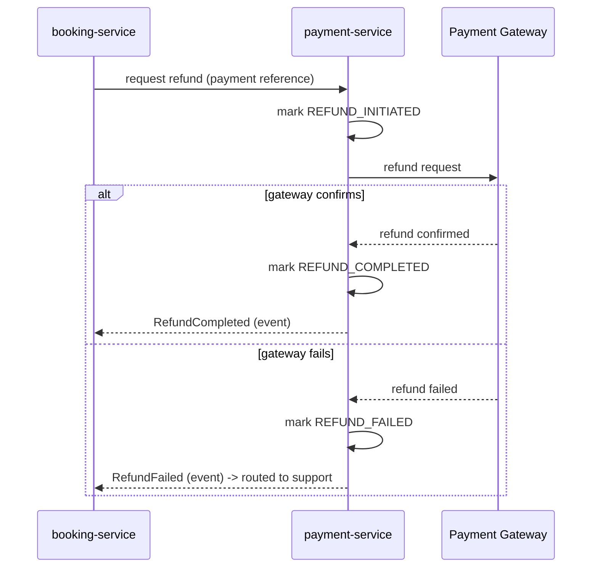

# Payment Flow

## Scope

Payment success, failure, timeout, cancellation, and refund scenarios, and how `payment-service` and `booking-service` coordinate through them today. Saga formalization is intentionally deferred — see the last section.

## Actors

Traveler (payer), `payment-service`, the external Payment Gateway, and `booking-service` (which consumes the outcome).

## Initiation

Once `booking-service` has created a `PENDING_PAYMENT` booking (see `booking-flow.md`), the client calls `payment-service` to initiate payment against that booking. `payment-service` creates a payment record (`INITIATED`) and starts the transaction with the external Payment Gateway — synchronously for methods that confirm immediately (e.g., card capture), asynchronously via webhook for methods that don't (e.g., UPI, some wallets).

## Scenarios

### Success

Gateway confirms payment (immediately or via webhook). `payment-service` marks the payment `COMPLETED` and emits `PaymentCompleted`. `booking-service` confirms the booking — see `booking-flow.md` step 4.

### Failure

Gateway declines or errors. `payment-service` marks the payment `FAILED` and emits `PaymentFailed`. `booking-service` cancels the booking and `inventory-service` releases the seat. The traveler may retry — a retry is a **new payment attempt against the same pending booking**, not a new booking, as long as the seat hold hasn't expired.

### Timeout

The gateway never responds within the acceptable window (webhook never arrives, or the synchronous call itself times out). `payment-service` cannot assume success or failure — it marks the payment `TIMED_OUT` once the window elapses and emits `PaymentTimedOut`. `booking-service` treats this the same as a failure for the traveler (cancel booking, release seat), but the distinct status is preserved for reconciliation, because a late gateway confirmation is still physically possible.

**Edge case — late success after a timeout-driven cancellation.** If the gateway's confirmation arrives *after* the booking has already been cancelled (and the seat possibly resold), `payment-service` still records the payment as `COMPLETED` for financial accuracy — the money did move. But `booking-service` cannot silently re-confirm a booking whose seat may be gone. This must trigger an **automatic refund** and a support-visible flag, never a silent "keep the traveler's money" outcome. This is a required reconciliation path, not a rare exception to hand-wave — any payment flow that can go async must account for it.

### Traveler-Initiated Cancellation (post-payment)

A `CONFIRMED` booking is cancelled by the traveler within policy. `booking-service` requests a refund from `payment-service`, referencing the original payment.

### Operator/Trip Cancellation

On `TripCancelled`, every affected `CONFIRMED` booking is refunded in full, regardless of the normal per-traveler cancellation-fee policy — see `booking-flow.md` step 7 for the reasoning.

## Refund Handling

A failed refund is **not silently retried forever** — `RefundFailed` routes to support (visible via `analytics-service`/`admin-console`) for manual intervention, because a stuck refund is a customer-trust issue that needs a human, not just another automatic retry.

## Idempotency

Payment-gateway webhooks are delivered at-least-once, same as Kafka (see `event-catalog.md`'s general delivery model). `payment-service` must treat a repeated notification for the same payment as a no-op — never as a double charge or a duplicate `PaymentCompleted` event.

## Consistency Approach Today, and Where Saga Comes In Later

Today, `booking-service` and `payment-service` coordinate through simple **choreography**: each reacts to the other's events (`PaymentCompleted`/`PaymentFailed`/`PaymentTimedOut` drive booking confirmation or cancellation; a cancellation drives a refund request). This is sufficient for the current shape of the flow — two services, one compensating step.

**Saga is deliberately not implemented yet.** As the platform adds more steps to this path — loyalty points, wallet balance, multi-item carts once Phase 2+ verticals exist — this loosely-coordinated choreography will stop being clear or reliable enough, and will be formalized into an explicit saga (see `high-level-design.md` §6), most likely orchestrated given `booking-service` is already the natural owner of the outcome, backed by a transactional outbox in each participating service so a DB write and its published event always commit atomically. That formalization happens when `booking-service` and `payment-service` are actually implemented — not designed in this document.

## Explicitly Not Designed Here

Payment-gateway-specific integration details, retry-interval numbers, and the saga state machine itself.
