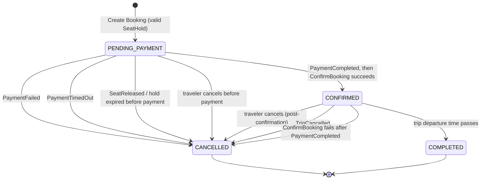
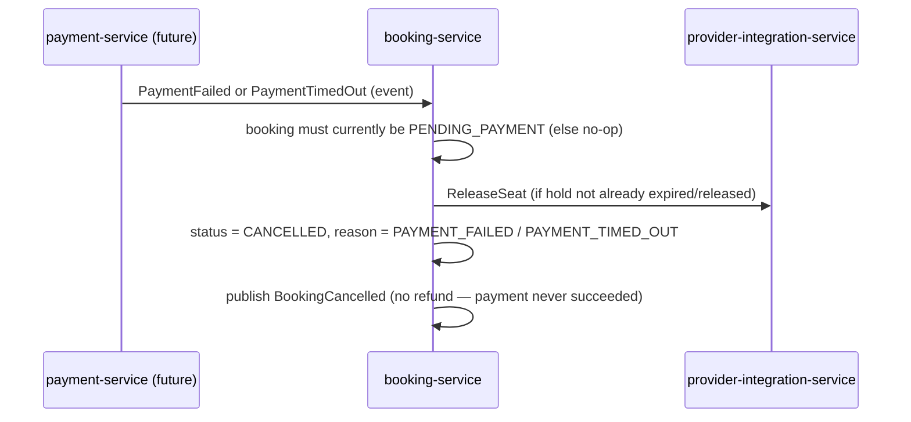
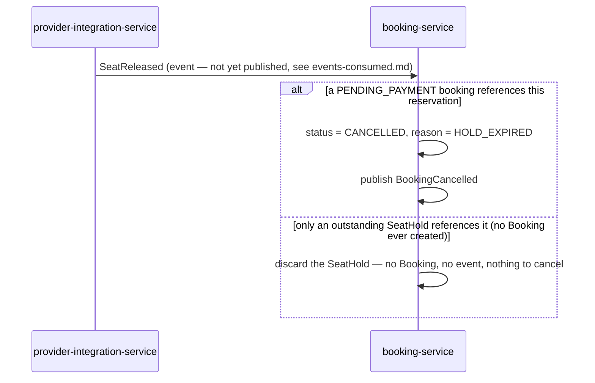
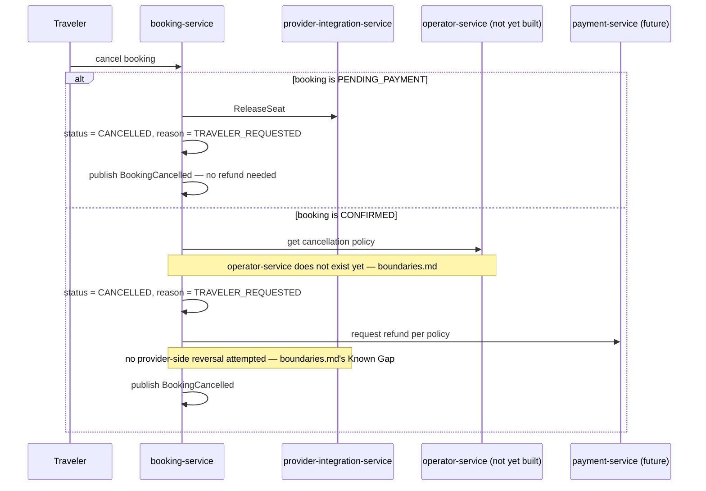
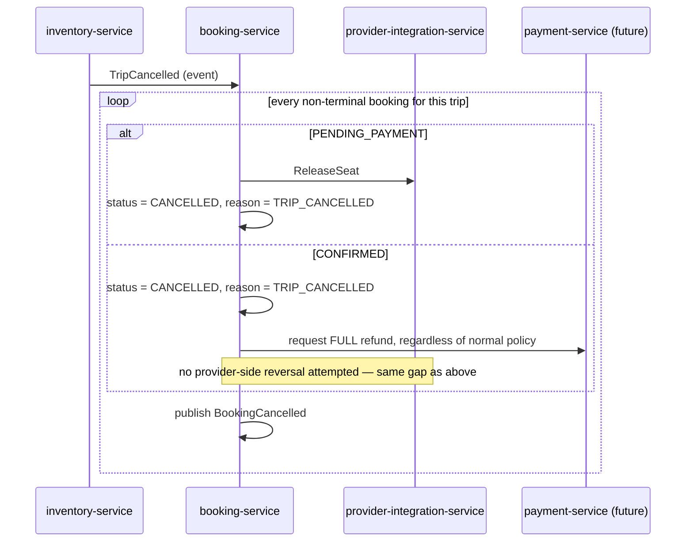
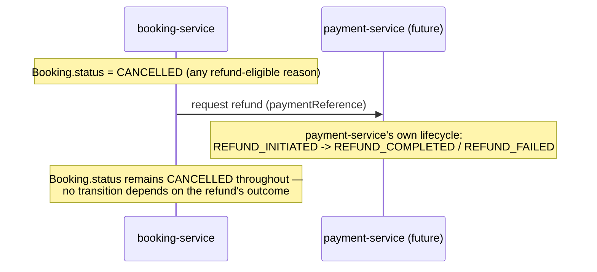
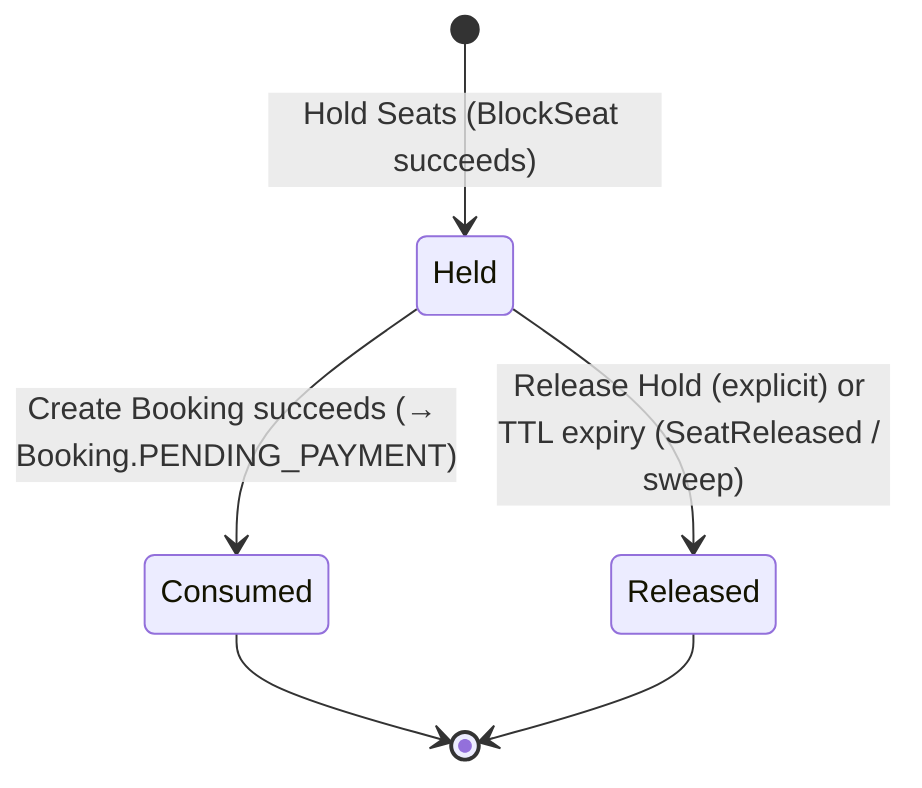

# Booking Service — Booking State Machine

This is the single authoritative reference for every valid `Booking` state transition, expanding
`domain-model.md`'s "State Machine" section into full detail per this specification's final
review. It documents no state or transition beyond what `domain-model.md` and
`docs/architecture/booking-flow.md`'s frozen diagram already define — this is a more detailed
*view* of that same machine, not a redesign of it.

## Canonical State Diagram

Four states — `PENDING_PAYMENT`, `CONFIRMED`, `CANCELLED`, `COMPLETED` — exactly matching
`docs/architecture/booking-flow.md`'s frozen diagram. Every arrow above is a *refinement* of that
diagram's five arrows (naming the specific trigger), not an addition to it. `CANCELLED` and
`COMPLETED` are both terminal — no transition leaves either.

## Full Transition Table

| From | To | Trigger | `CancellationReason` | Who Initiates | Idempotent? |
|---|---|---|---|---|---|
| *(none — booking doesn't exist)* | `PENDING_PAYMENT` | `Create Booking` succeeds against a still-valid `SeatHold` | — | Client, via `booking-service` | N/A — see "Hold token becomes at most one booking" |
| `PENDING_PAYMENT` | `CONFIRMED` | `PaymentCompleted` consumed, then `ConfirmBooking` succeeds | — | Event (`payment-service`), then `booking-service`'s own synchronous provider call | Yes — a repeat `PaymentCompleted` for an already-`CONFIRMED` booking is a no-op |
| `PENDING_PAYMENT` | `CANCELLED` | `PaymentFailed` consumed | `PAYMENT_FAILED` | Event (`payment-service`) | Yes |
| `PENDING_PAYMENT` | `CANCELLED` | `PaymentTimedOut` consumed | `PAYMENT_TIMED_OUT` | Event (`payment-service`) | Yes |
| `PENDING_PAYMENT` | `CANCELLED` | `SeatReleased` consumed, or stale-hold sweep, for a booking whose hold expired before any payment attempt began | `HOLD_EXPIRED` | Event (`provider-integration-service`) or scheduled sweep | Yes |
| `PENDING_PAYMENT` | `CANCELLED` | Traveler explicitly cancels before paying | `TRAVELER_REQUESTED` | Client, via `booking-service` | Yes |
| `CONFIRMED` | `CANCELLED` | Traveler explicitly cancels after confirmation | `TRAVELER_REQUESTED` | Client, via `booking-service` | Yes |
| `CONFIRMED` | `CANCELLED` | `TripCancelled` consumed | `TRIP_CANCELLED` | Event (`inventory-service`) | Yes |
| `CONFIRMED` | `CANCELLED` | `ConfirmBooking` fails *after* `PaymentCompleted` already succeeded | `PROVIDER_CONFIRMATION_FAILED` | `booking-service`'s own synchronous provider call, reacting to the event above | Yes — see "The One Transition That Also Sets a Flag" below |
| `CONFIRMED` | `COMPLETED` | Scheduled sweep, trip departure time has passed | — | Scheduled (`Complete Booking`, `use-cases.md`) | Yes — sweeping an already-`COMPLETED` booking is a no-op |

**Every transition is idempotent** — a duplicate delivery of any trigger above must produce no
observable change the second time, matching `docs/architecture/event-catalog.md`'s platform-wide
at-least-once delivery model. This is enforced by checking current `status` before applying a
transition (a transition whose "from" state doesn't match the booking's current `status` is
rejected as a no-op, not applied out of order), backed by the `version` optimistic-lock column
(`domain-model.md`'s "Concurrency") for the case where two triggers for the same booking race each
other.

## Payment Failure

No refund is requested on this path — `docs/architecture/event-catalog.md`'s stated rule:
*"a cancellation from the `PENDING_PAYMENT` state (payment never succeeded) requires no refund
action."*

## Hold Expiry (Before Any Payment Attempt)

**This is the one transition whose trigger is not yet real** — `provider-integration-service`
does not yet publish `SeatReleased` (`events-consumed.md`). Until it does, `Sweep Stale Holds`
(`use-cases.md`) is the interim mechanism that reaches the same `HOLD_EXPIRED` outcome by directly
comparing a `PENDING_PAYMENT` booking's held reservation `expiresAt` against the current clock,
rather than waiting on an event.

## Cancellation (Traveler-Initiated)

## Cancellation (Trip-Cancellation Cascade)

No `operator-service` call on this path — `docs/architecture/booking-flow.md` step 7's explicit
rule (full refund regardless of policy) makes the policy lookup unnecessary here, unlike the
traveler-initiated case above.

## The One Transition That Also Sets a Flag

`CONFIRMED → CANCELLED` via `ConfirmBooking` failing after `PaymentCompleted` already succeeded
is the single transition in this machine that also sets `supportFlagged = true`
(`domain-model.md`). This is `docs/architecture/booking-flow.md`'s explicitly required
reconciliation path — *"this must trigger an automatic refund and a support-visible flag."* The
same flag, for the same reason, is set on the symmetric case where `PaymentCompleted` arrives
*after* a `PENDING_PAYMENT` booking was already cancelled by `PaymentTimedOut`
(`docs/architecture/payment-flow.md`'s "Edge case — late success after a timeout-driven
cancellation") — that case does not appear as a row in the transition table above because it does
not move `status` at all (the booking is already `CANCELLED`); it only triggers a refund plus the
flag, handled as a no-op-for-`status`-purposes branch of `Handle Payment Completed`
(`use-cases.md`).

## Future Refund — Deliberately Not a State

`REFUNDED` is not, and will not become, a `Booking` status in this machine — see
`domain-model.md`'s "Reconciling the Requested State Vocabulary" for the full reasoning. A refund
is `payment-service`'s own lifecycle (`INITIATED`/`COMPLETED`/`FAILED`), triggered by
`booking-service` reaching `CANCELLED` with a refund-eligible reason, never a status this
service's own state machine transitions into or out of:

`booking-service` records only that a refund was requested (implied by `cancellationReason` plus
the existence of a `paymentReference`); it does not track `REFUND_COMPLETED` vs. `REFUND_FAILED`
as part of this state machine. A failed refund is `payment-service`'s own routed-to-support
concern (`docs/architecture/payment-flow.md`: *"a failed refund is not silently retried
forever... routes to support"*), independent of anything `Booking.status` represents.

## Hold Token Becomes At Most One Booking

Not a `Booking`-state transition, but the invariant that gates entry into `PENDING_PAYMENT` in the
first place (`domain-model.md`'s invariants, `docs/architecture/booking-flow.md`'s idempotency
requirement):

A `SeatHold` in `Held` can only ever move to `Consumed` (becoming exactly one `Booking`) or
`Released` (becoming zero bookings) — never both, and never more than one `Booking`. This is what
makes the earlier `PENDING_PAYMENT` transition idempotent with respect to hold-token retries: a
second `Create Booking` call against an already-`Consumed` hold finds no matching `SeatHold` and
fails cleanly, rather than creating a duplicate booking.

## Cross-References

- `domain-model.md` — the aggregates and value objects these transitions operate on
  (`Booking`, `SeatHold`, `CancellationReason`).
- `use-cases.md` — the inbound ports (`Create Booking`, `Cancel Booking`, `Handle Payment
  Completed`, ...) that trigger these transitions.
- `sequence-diagrams.md` — the full cross-service call sequences each trigger sits inside,
  including the `inventory-service`/`provider-integration-service` calls around each transition.
- `events-published.md` / `events-consumed.md` — the exact events named in the trigger column
  above.
- `boundaries.md` — the "Known Gap" sections explaining why `CONFIRMED → CANCELLED` never attempts
  a provider-side reversal today.
