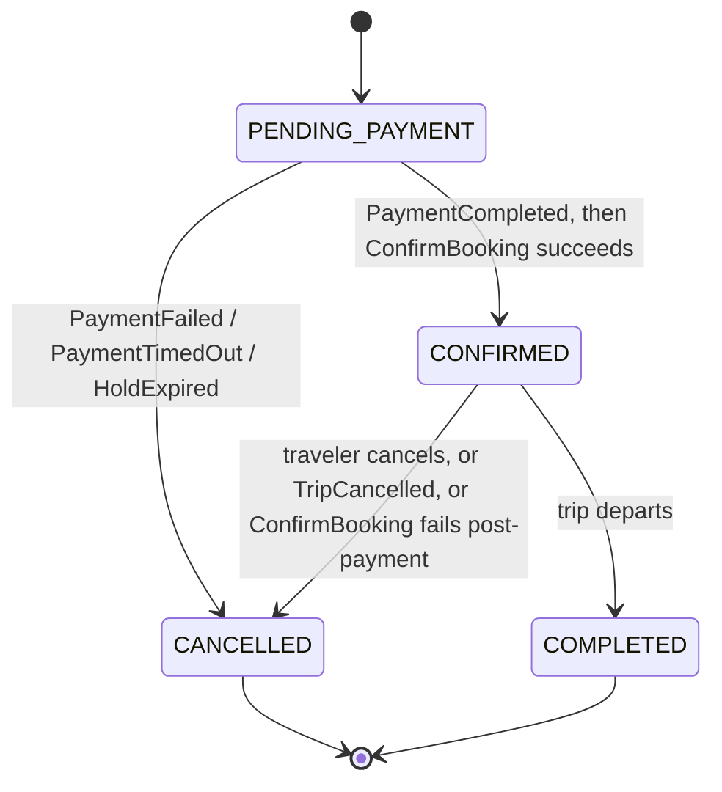

# Booking Service — Domain Model

## Why This Model Looks the Way It Does

`booking-service` protects one real, high-stakes invariant — a booking's state transitions must
be correct and exclusive to this service (NFR-7) — and otherwise holds mostly **captured-at-a-
point-in-time copies** of facts owned elsewhere (trip shape from `inventory-service`, provider
identity from `ProviderMapping`, fare from `FareSnapshot`). This mirrors
`inventory-service`'s own framing of its `Trip` aggregate: real rules where they matter, a
denormalized copy everywhere else, never a second source of truth for data another service owns.

The one structural decision worth calling out up front: **`SeatHold` and `Booking` are two
separate aggregates**, not one. A hold exists before a booking does — a traveler can hold seats,
look at them, and never proceed to booking at all (FR-3.4's abandonment case). Modeling them
together would force `Booking` to exist in a state that isn't really a booking yet. See
"`SeatHold`" below and `boundaries.md`'s "Known Gap: No Read-Only Reservation-Status Check" for
why this split is also what makes booking-creation validation possible without a
`provider-integration-service` operation that doesn't exist.

## Core Concepts

### `BookingId`

A UUID-wrapping value object, matching every other identifier on this platform (`TripId`,
`ProviderSessionId`, ...). Assigned by `booking-service` at booking-creation time, never by a
client.

### `SeatHoldId` / `SeatHold` (aggregate, short-lived)

The local record of a seat hold `booking-service` placed with `provider-integration-service`,
before any `Booking` exists:

- `id` (`SeatHoldId`)
- `travelerId` — whose hold this is, so a hold cannot be converted into a booking by anyone else
- `tripId` — the `inventory-service` canonical trip id
- `providerType`, `providerTripId` — captured from the trip's `ProviderMapping` at hold time
- `providerBlockReference` — the reservation reference `provider-integration-service`'s
  `BlockSeat` returned
- `seatNumbers` — the specific seats held
- `expiresAt` — the TTL `provider-integration-service` returned at hold time; this is the field
  `boundaries.md`'s "Known Gap: No Read-Only Reservation-Status Check" resolution depends on
- `createdAt`

**Lifecycle:** created by `Hold Seats`; consumed (deleted or marked `CONSUMED` — an
implementation decision, not fixed here) exactly once, by a successful `Create Booking`; or
released explicitly (`Release Hold`, the traveler abandons checkout) or left to expire on its own
TTL (`provider-integration-service`'s own mechanism — `docs/architecture/seat-locking-flow.md`).
A `SeatHold` past its `expiresAt` is treated as already gone by `booking-service`, whether or not
`provider-integration-service` has published `SeatReleased` for it yet — see `events-consumed.md`.

**Why this isn't itself a `Booking` in a `HOLDING` state:** a hold that's abandoned (the common
FR-3.4 case) would otherwise leave a `Booking` row that never became a real booking, complicating
every query that means "show me this traveler's bookings" (`ListBookingHistory` would need to
filter out rows nobody would recognize as a booking). Keeping `SeatHold` a separate, disposable
aggregate means `Booking` rows only ever exist for interactions the traveler actually committed to.

### `Booking` (aggregate root)

The one thing this service exists to own:

- `id` (`BookingId`)
- `travelerId` — the owner; every authorization check in `boundaries.md`'s "Booking ↔ Auth"
  resolves against this field
- `tripId` — the `inventory-service` canonical trip id
- `providerType`, `providerTripId`, `providerBlockReference` — carried over from the `SeatHold`
  that became this booking, so `booking-service` never needs to re-resolve `ProviderMapping` to
  act on an existing booking
- `providerBookingReference` — populated only once `ConfirmBooking` succeeds; `null` before then
- `passengers` — `List<Passenger>` (see below), fixed at booking creation
- `fare` — amount + currency, captured from `inventory-service`'s `FareSnapshot` at hold time,
  same non-authoritative-snapshot posture `inventory-service` itself already uses for the same
  data; a booking's charged amount is what was quoted at hold time, not whatever the catalog
  fare happens to be later
- `status` (`BookingStatus`) — see "State Machine" below
- `cancellationReason` — `null` unless `status = CANCELLED`; see `CancellationReason` below
- `supportFlagged` — `boolean`, set only by the one edge case in `boundaries.md`
  (provider confirmation failing after payment already succeeded) and by the analogous late-
  payment-success-after-cancellation edge case (`docs/architecture/payment-flow.md`'s "Edge case
  — late success after a timeout-driven cancellation") — both require a human to look at the
  booking, not just an automated refund
- `paymentReference` — opaque reference into `payment-service`'s own ledger, once that service
  exists; `null` until a payment attempt is associated with this booking
- `ticket` — `Ticket` value object (see below), populated only once `CONFIRMED`
- `createdAt`, `confirmedAt`, `cancelledAt`, `completedAt` — each `null` until the corresponding
  transition occurs; together, the full audit trail this specification's "booking audit metadata"
  responsibility refers to
- `version` — optimistic-locking column (see "Concurrency" below)

**Deliberately not held:** anything about current seat occupancy for *other* seats on the trip
(that's `inventory-service`'s `SeatLayout` shape plus `provider-integration-service`'s live
status, composed fresh on demand, never stored here), and anything about the payment gateway
transaction itself (gateway references and status live entirely in `payment-service`, per NFR-12
— `booking-service` holds only an opaque reference to look one up, never the transaction detail).

### `Passenger` (value object, embedded in `Booking`)

`fullName`, `age`, `gender`, `seatNumber` — **deliberately field-for-field identical** to
`provider-integration-service`'s own `PassengerDetail`/`PassengerRequest` shape
(`docs/services/provider-integration-service/domain-model.md`), the same "no translation needed
at the boundary" discipline already established between `inventory-service`'s
`CatalogTripEventMessage` and `search-service`'s `TripEventMessage`. `booking-service` passes this
list straight through to `ConfirmBooking` without remapping field names.

### `BookingStatus` (enum)

Exactly the four states `docs/architecture/booking-flow.md`'s frozen state diagram defines — no
more, no fewer:

```
PENDING_PAYMENT → CONFIRMED → COMPLETED
PENDING_PAYMENT → CANCELLED
CONFIRMED → CANCELLED
```

`PENDING_PAYMENT` is the *only* initial state — there is no separate "just created, not yet
awaiting payment" state, because a `Booking` row does not exist until it is, by construction,
awaiting payment (see `SeatHold` above for what exists before that point). See "Reconciling the
Requested State Vocabulary" below for why this list is shorter than the states this
specification's own request asked to be documented "at minimum," and how each requested concept
is still represented.

### `CancellationReason` (enum, set only when `status = CANCELLED`)

`PAYMENT_FAILED`, `PAYMENT_TIMED_OUT`, `HOLD_EXPIRED`, `TRAVELER_REQUESTED`, `TRIP_CANCELLED`,
`PROVIDER_CONFIRMATION_FAILED`. This is where the *reason* a booking never became or stopped being
confirmed is recorded — see "Reconciling the Requested State Vocabulary" below.

### `Ticket` (value object, embedded in `Booking`, populated only once `CONFIRMED`)

`providerTicketId`, `format`, `content` (the provider-issued document, persisted here — see
`data-ownership.md` for why), `issuedAt`. Deliberately field-compatible with
`provider-integration-service`'s `ProviderTicket`/`TicketResponse` shape for the same reason
`Passenger` is.

## State Machine



Identical in shape to `docs/architecture/booking-flow.md`'s frozen diagram — this specification
does not redesign it. `booking-service` owns this state machine exclusively; no event or call
from any other service mutates `status` directly — every external trigger (a Kafka event, a
client request) is translated into one of the transitions above by `booking-service`'s own
application layer.

**Every transition is idempotent.** A duplicate `PaymentCompleted` delivery, a second
`TripCancelled` for an already-cancelled booking, or a repeated cancel request must be a no-op,
not an error — matching `docs/architecture/event-catalog.md`'s general at-least-once delivery
model and the identical pattern `inventory-service`'s `Trip.cancel()` and
`provider-integration-service`'s `ProviderSession` transitions already establish platform-wide.

## Reconciling the Requested State Vocabulary

This specification's request lists, "at minimum," `CREATED`, `PENDING_PAYMENT`,
`PAYMENT_FAILED`, `CONFIRMED`, `CANCELLED`, `EXPIRED`, `REFUNDED` (future). Compared directly
against the frozen `docs/architecture/booking-flow.md` state diagram, this is a **real conflict**,
not just a difference in naming — the frozen diagram has four states, none of them named
`CREATED`, `PAYMENT_FAILED`, or `EXPIRED`, and failure/timeout transition *directly* to
`CANCELLED` rather than through an intermediate state. Per this specification's own instruction
("if documentation reveals an architectural conflict, stop and explain the conflict before
continuing"), here is the conflict and its resolution, rather than a silent redesign of either
document:

| Requested concept | Where it actually lives in this model | Why |
|---|---|---|
| `CREATED` | The `BookingCreated` event, fired the instant a `Booking` is persisted in `PENDING_PAYMENT` — not a distinct status. | The frozen diagram's very first transition is `[*] --> PENDING_PAYMENT` — there is no state before it. Introducing a `CREATED` status would mean either a booking briefly exists with no relationship to payment (contradicting "a `Booking` row does not exist until it is awaiting payment," above) or `CREATED` and `PENDING_PAYMENT` would be the same state under two names. `BookingCreated` (the event — already in `docs/architecture/event-catalog.md`) is the concept the request is reaching for. |
| `PAYMENT_FAILED` | `CancellationReason.PAYMENT_FAILED`, under the terminal `CANCELLED` status. | The frozen diagram states `PENDING_PAYMENT --> CANCELLED: PaymentFailed / PaymentTimedOut` explicitly — payment failure is documented as a trigger for the `CANCELLED` transition, not a state of its own. Adding a standalone `PAYMENT_FAILED` status would contradict this diagram, which `docs/architecture/booking-flow.md` states is owned exclusively by `booking-service` and already corrected once by architecture review. A reason code preserves the distinction the request wants (a booking cancelled for lack of payment reads differently from one cancelled by the traveler) without adding a state the frozen machine doesn't have. |
| `EXPIRED` | `CancellationReason.HOLD_EXPIRED`, under the terminal `CANCELLED` status. | Same reasoning — an unexpired-but-abandoned hold never becomes a `Booking` at all (see `SeatHold`); a hold that expires *after* a `Booking` already exists in `PENDING_PAYMENT` (the traveler never reaches `payment-service`) is exactly the case `events-consumed.md`'s `SeatReleased` handling exists for, and it resolves to `CANCELLED` with this reason. |
| `CONFIRMED` | Unchanged — `BookingStatus.CONFIRMED`. | Matches the frozen diagram exactly. |
| `CANCELLED` | Unchanged — `BookingStatus.CANCELLED`, now carrying `CancellationReason`. | Matches the frozen diagram exactly; the reason code is the refinement. |
| `REFUNDED` (future) | **Deliberately not a `Booking` status at all.** A refund's own state (`INITIATED`/`COMPLETED`/`FAILED`) belongs to `payment-service` (`docs/architecture/payment-flow.md`'s "Refund Handling"; `docs/architecture/service-boundaries.md`'s `payment-service` entry). `booking-service` tracks only whether a refund was *requested* for a `CANCELLED` booking (implied by `cancellationReason` plus `paymentReference`), never the refund's own lifecycle. | Introducing a `REFUNDED` booking status would duplicate `payment-service`'s ownership of refund state — the same "no service is a passthrough to another's database" rule `docs/architecture/service-boundaries.md` states platform-wide, applied to a derived status instead of a table. |
| `COMPLETED` (not in the request's list, but in the frozen diagram) | Unchanged — `BookingStatus.COMPLETED`. | Not requested, but required: FR-7.2 ("a review can only be submitted against a verified, **completed** booking") and `docs/requirements/actors.md`'s Scheduler/System Jobs actor ("closing out bookings after departure") both depend on this state existing. Removing it would break a functional requirement this specification does not have authority to change. |

**This table is the resolution, not a suggestion** — `domain-model.md`'s `BookingStatus` enum
above is the one this specification adopts. If a future revision genuinely needs `PAYMENT_FAILED`
or `EXPIRED` as first-class statuses (for example, a product requirement to let a traveler retry
payment on a `PAYMENT_FAILED` booking rather than starting over), that is a change to the frozen
`docs/architecture/booking-flow.md` diagram itself, and must be made there first, by whoever owns
that document — not smuggled into an implementation as `booking-service`-local schema drift, which
is exactly what happened to the seat-holding model before it.

## Invariants

- A `Booking` is never created without a valid, unexpired `SeatHold` — see `use-cases.md`'s
  "Create Booking."
- A `SeatHold` becomes **at most one** `Booking` — `docs/architecture/booking-flow.md`'s
  idempotency requirement. The exact enforcement mechanism (e.g., a unique constraint on
  `providerBlockReference` in the `bookings` table, or atomically deleting the `SeatHold` on
  conversion) is an implementation decision, not fixed here, matching that document's own hedge:
  "the exact mechanism is a `booking-service` implementation decision, not designed here."
- `status` only ever moves forward through the state machine above; there is no transition back
  to `PENDING_PAYMENT` from any other state, and no transition out of `CANCELLED` or `COMPLETED`
  (both terminal).
- `providerBookingReference` and `ticket` are populated together, exactly once, only on the
  `PENDING_PAYMENT → CONFIRMED` transition; never before, never mutated after.
- `cancellationReason` is set exactly once, at the moment `status` becomes `CANCELLED`; never
  overwritten by a later duplicate cancellation trigger (idempotent handling — see "Every
  transition is idempotent" above).
- A trip with no `ProviderMapping` cannot have a `SeatHold` or `Booking` created against it — see
  `overview.md`'s ambiguity #2 and `use-cases.md`'s "Hold Seats."

## Concurrency

**Optimistic locking (`version`) on `Booking`**, the same platform-wide pattern
`inventory-service`'s `Trip` and `search-service`'s `SearchableTrip` already use — guards against
two concurrent triggers racing on the same booking (most plausibly: a `PaymentCompleted` event
being processed at the same moment a traveler-initiated cancellation request arrives for the same
`PENDING_PAYMENT` booking). Whichever write loses the version check is retried by its own
handler's normal retry/redelivery semantics (Kafka redelivery for the event path, a client retry
for the REST path) — never silently dropped.

**No distributed lock is needed for `SeatHold` creation** — the actual "only one traveler gets
this seat" guarantee is enforced entirely by `provider-integration-service`'s `BlockSeat` call
(`docs/architecture/seat-locking-flow.md`'s "the provider's own backend is what actually prevents
two RoadScanner travelers... from double-booking the same seat" for the third-party-provider case,
which is the only case reachable today — see `overview.md`'s ambiguity #2). `booking-service`
never needs its own seat-level lock, because it never itself decides seat availability.

## Soft Delete

**None.** No `Booking` row is ever deleted, and no soft-delete flag exists. `CANCELLED` and
`COMPLETED` are terminal *statuses*, not deletions — FR-1.3's booking history requirement depends
on every booking a traveler ever made remaining queryable indefinitely, including cancelled ones.
`SeatHold` rows, by contrast, are genuinely transient and may be physically deleted once consumed,
released, or expired — they were never booking history to begin with.

## Aggregate Summary

| Concept | Kind | Authority | Kept Current By |
|---|---|---|---|
| `Booking` | Aggregate root | Owned outright — the platform's only source of truth for booking records | This service's own state machine |
| `SeatHold` | Aggregate, short-lived | Owned outright, but transient by design | `Hold Seats` / `Release Hold` / TTL expiry / `SeatReleased` |
| `Passenger` | Value object, embedded in `Booking` | Owned outright, fixed at creation | N/A — immutable once set |
| `Ticket` | Value object, embedded in `Booking` | Owned outright, captured once | `ConfirmBooking`'s result, persisted once |
| Trip shape, fare, `ProviderMapping` | **Not owned** — captured copy only | `inventory-service` | Re-read at hold time; not refreshed after |
| Live seat state | **Not modeled here at all** | `provider-integration-service` | N/A |
| Payment/refund state | **Not modeled here at all** — only an opaque reference | `payment-service` | N/A |
