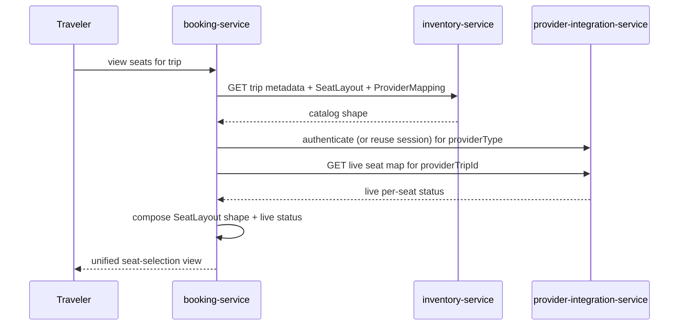
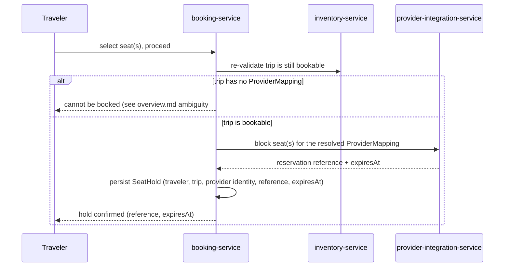
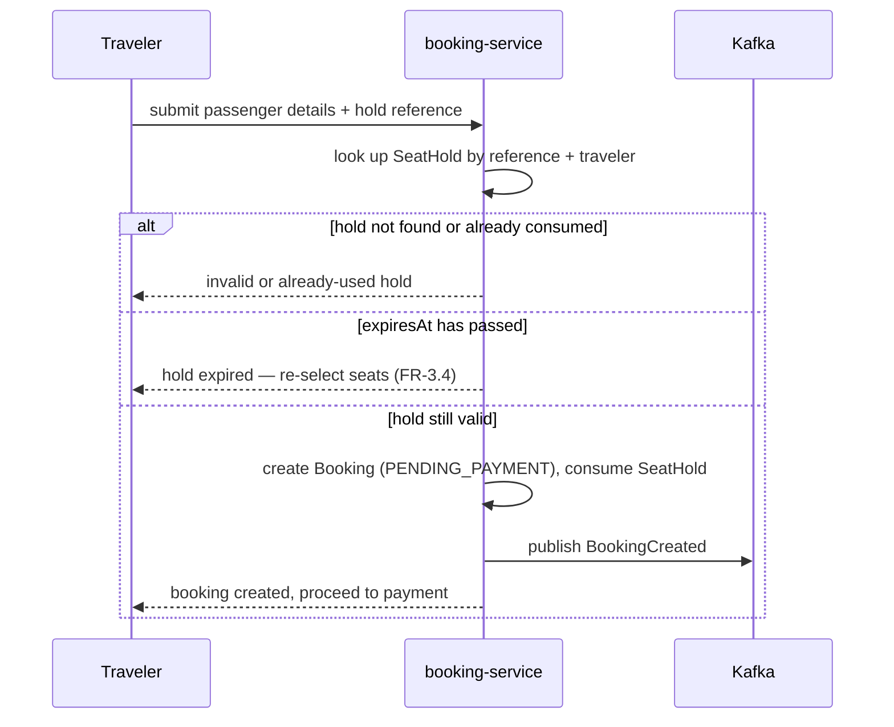
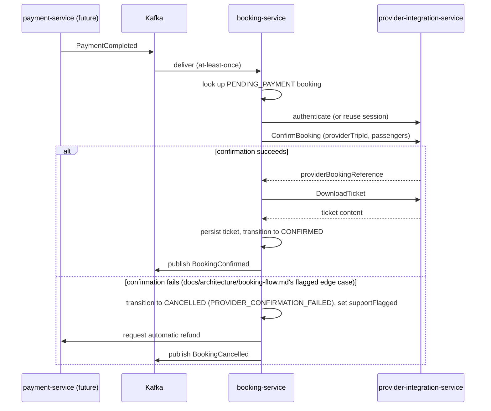
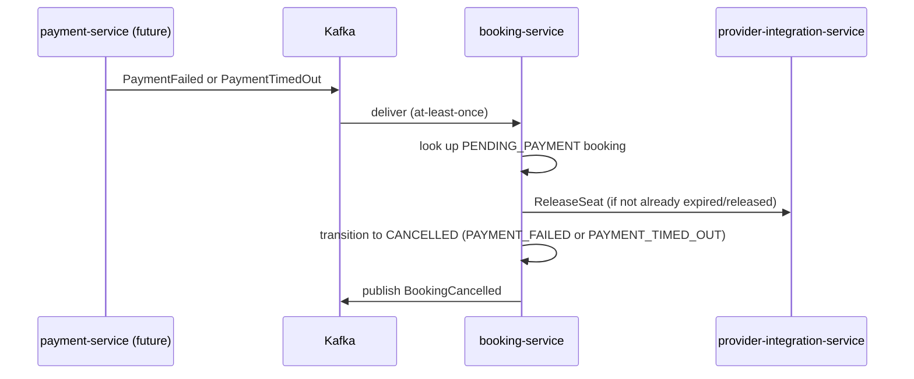
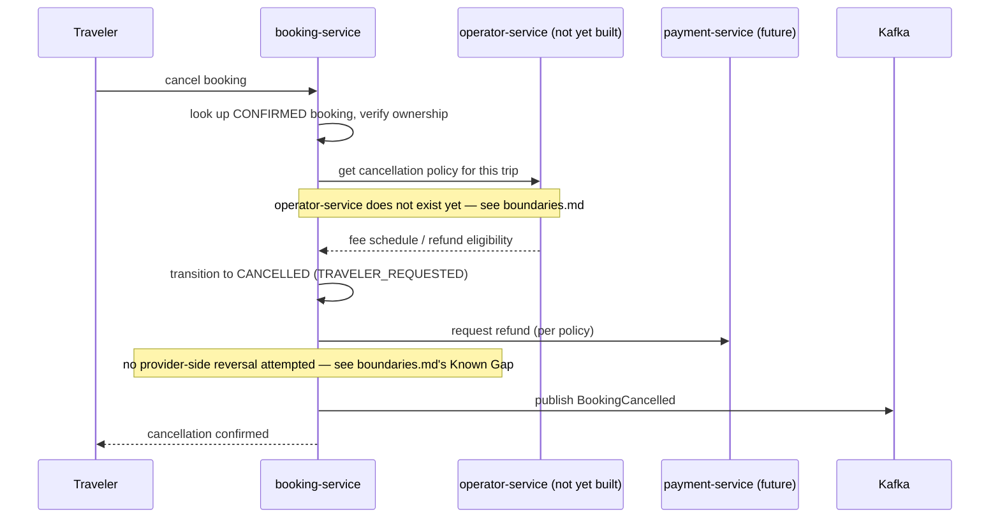
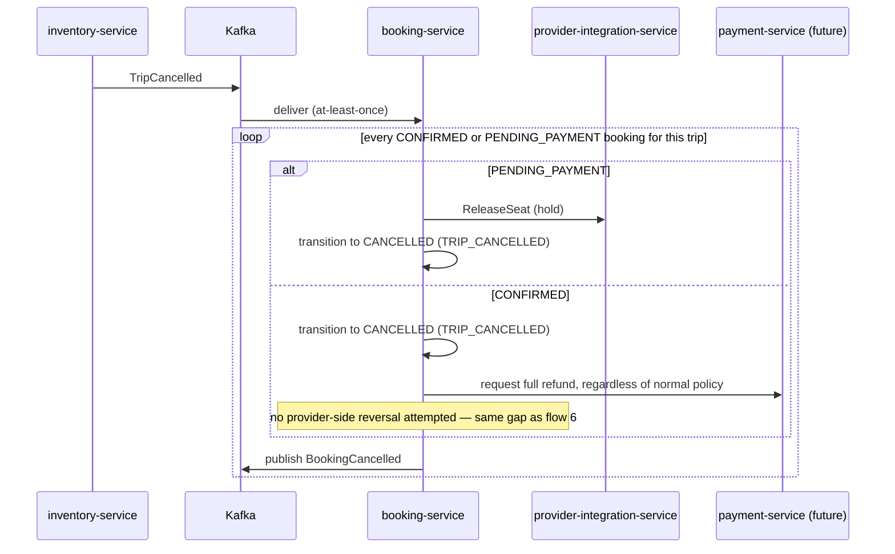

# Booking Service — Sequence Diagrams

Seven flows: seat selection, hold, booking creation, payment success, payment failure/timeout,
traveler-initiated cancellation, and trip-cancellation cascade. Each corresponds directly to a row
in `use-cases.md`.

## 1. Seat Selection View (Composing Catalog + Live Status)

Identical to `docs/services/inventory-service/sequence-diagrams.md` flow 4 — reproduced here as
this service's own record of the same flow, since it is `booking-service`'s use case, not
`inventory-service`'s. `inventory-service` is not involved beyond the first call.

## 2. Hold Seats

Matches `docs/services/inventory-service/sequence-diagrams.md` flow 5, with the addition of the
re-validation step and the local `SeatHold` persistence — flow 5 stops at "hold confirmed" because
that document is `inventory-service`'s own record of the boundary, not the full flow.

## 3. Create Booking

The "still valid" check is a **local comparison against `expiresAt`**, not a fresh call to
`provider-integration-service` — see `boundaries.md`'s "Known Gap: No Read-Only
Reservation-Status Check" for why no such call exists to make.

## 4. Payment Success → Confirmation

The reservation is guaranteed active at this point under normal operation — `provider-integration-service`'s
hold TTL is deliberately longer than the maximum acceptable payment-processing time
(`docs/architecture/seat-locking-flow.md`). The `else` branch is the rare, required exception, not
the common case.

## 5. Payment Failure / Timeout

No refund is requested — payment never succeeded (`docs/architecture/event-catalog.md`'s stated
failure consideration for `BookingCancelled`'s consumers).

## 6. Traveler-Initiated Cancellation (Post-Confirmation)

**No call to `provider-integration-service` appears in this diagram** — this is deliberate, not
an omission. See `boundaries.md`'s "Known Gap: Post-Confirmation Cancellation" for why.

## 7. Trip Cancellation Cascade

The full-refund rule for the `CONFIRMED` branch is `docs/architecture/booking-flow.md` step 7's
explicit business rule — the traveler didn't cause the cancellation, so the standard per-traveler
fee schedule from `operator-service` doesn't apply, meaning this branch (unlike flow 6) needs no
`operator-service` call at all.
