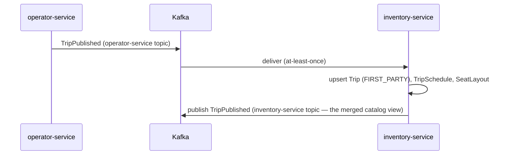
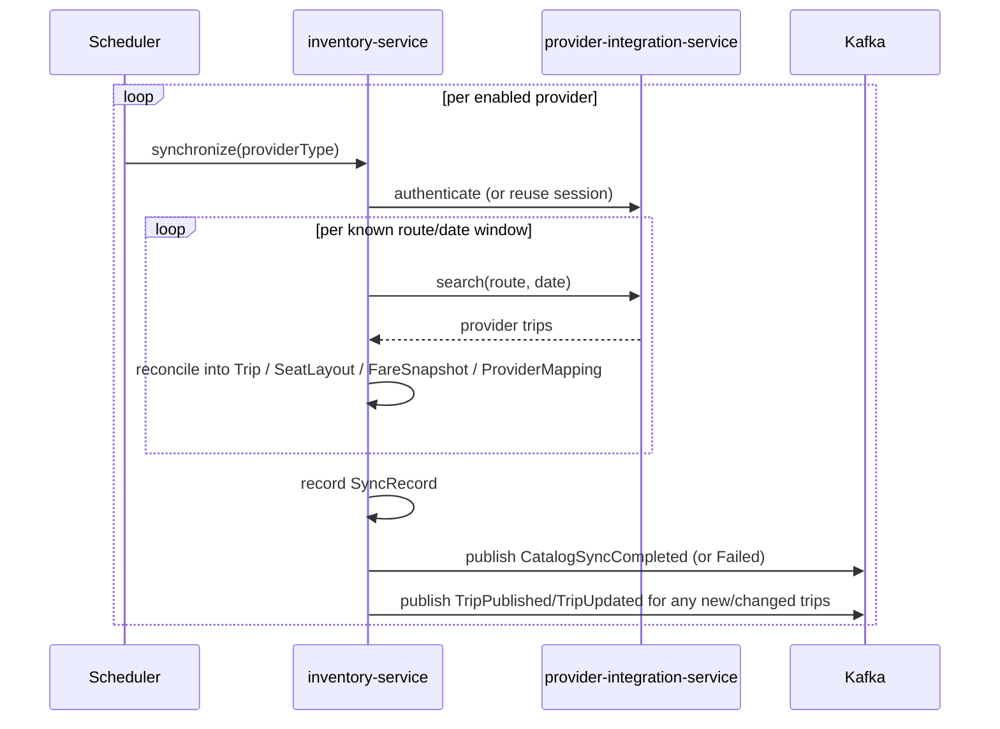
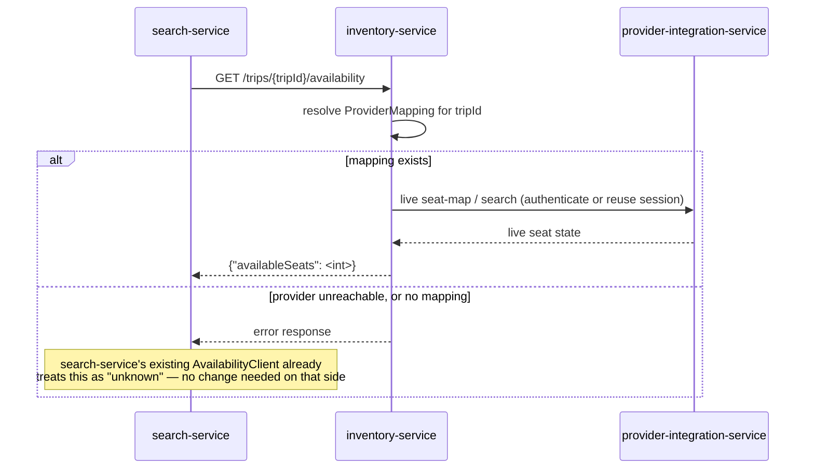
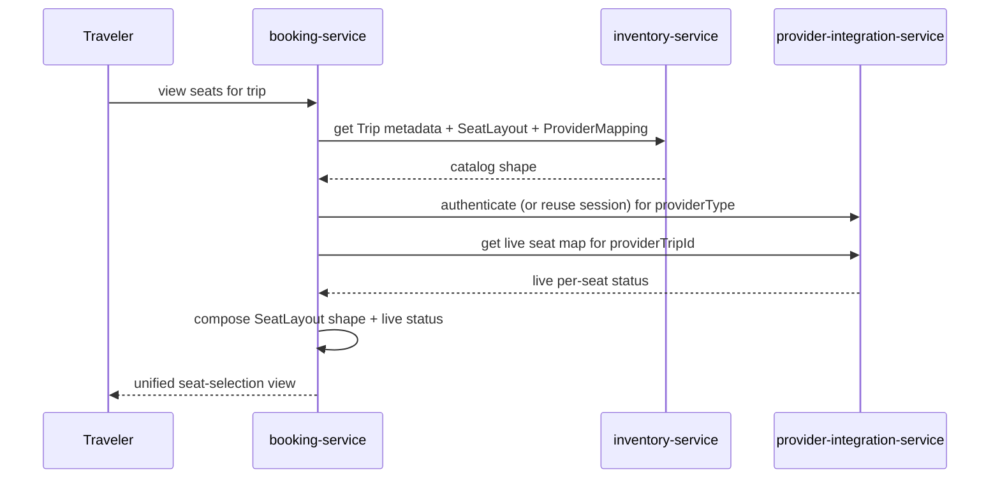
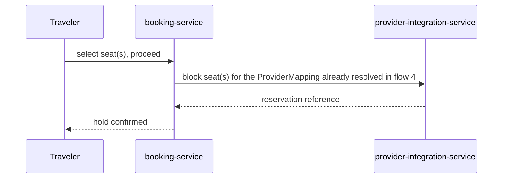

# Inventory Service — Sequence Diagrams

Five flows: first-party ingestion, provider catalog synchronization, the availability facade
(what `search-service` actually triggers today), and the two booking-time flows that replace the
old (incorrect) direct-hold-against-inventory design.

## 1. First-Party Trip Published → Catalog Updated

Two different topics, two different producers, same event name by design — see
`events-published.md` for why this isn't a naming collision in practice.

## 2. Scheduled Provider Catalog Synchronization

A failure against one provider does not stop synchronization for the others — same
failure-isolation principle `provider-integration-service`'s own `ProviderHealthMonitor` already
applies.

## 3. Search Service Queries Availability (the facade — contract unchanged)

This is the diagram that proves point 4 of the review: `search-service` issues the exact same
call it issues today, gets the exact same response shape, and never learns that a provider is
involved at all.

## 4. Booking Service Composes the Seat-Selection View

`inventory-service` is not in this diagram after the first call — it has nothing further to
contribute once catalog shape is handed over.

## 5. Booking Service Creates a Seat Hold (replaces the old, incorrect direct-to-inventory flow)

`inventory-service` does not appear here at all — it already did its job in flow 4. This is the
direct replacement for the previous version of this document's "Traveler Creates a Seat Hold"
diagram, which incorrectly placed `inventory-service` where `provider-integration-service` now
sits. See `docs/architecture/booking-flow.md` (corrected by this review) for how this fits into
the full booking lifecycle, including payment and confirmation.
