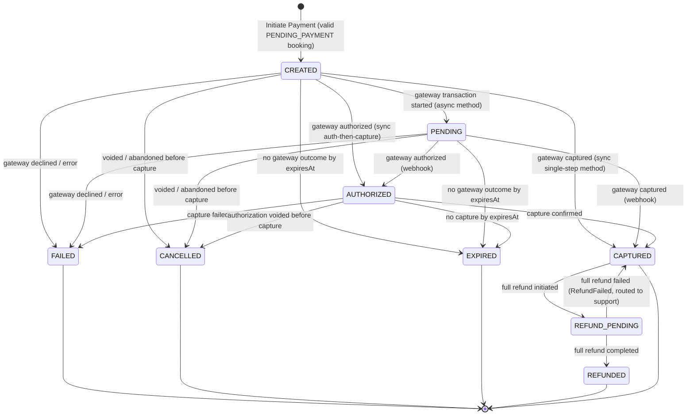
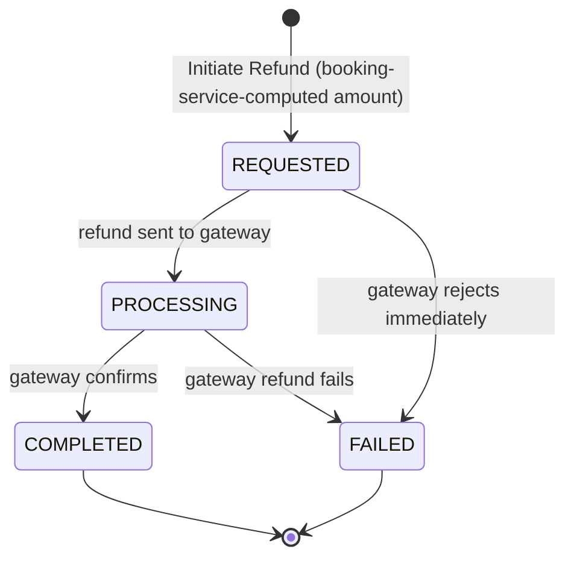

# Payment Service — Payment State Machine

This is the single authoritative reference for every valid `Payment` and `Refund` state transition,
expanding `domain-model.md`'s "Core" state definitions into full detail. It documents the richer
internal state machine the brief asks for, **mapped onto** `docs/architecture/payment-flow.md`'s
frozen coarse vocabulary and event names — the reconciliation of `overview.md`'s Conflict 3. Where a
transition emits a cross-service event, that event uses the frozen name
(`docs/architecture/event-catalog.md`), so `booking-service`'s frozen consumer contract is untouched.

## Canonical Payment State Diagram

Nine states, exactly the set the brief asks to model *at minimum* (`CREATED`, `PENDING`,
`AUTHORIZED`, `CAPTURED`, `FAILED`, `CANCELLED`, `REFUND_PENDING`, `REFUNDED`, `EXPIRED`).
`FAILED`, `CANCELLED`, `EXPIRED`, and `REFUNDED` are terminal; `CAPTURED` is terminal for the
forward path but may enter and — on a failed full refund — return from the refund sub-lifecycle.

## Full Payment Transition Table

| From | To | Trigger | Emitted event | Who Initiates | Idempotent? |
|---|---|---|---|---|---|
| *(none)* | `CREATED` | `Initiate Payment` succeeds (valid idempotency key, one non-terminal `Payment` per booking) | `PaymentCreated` *(informational — see note below)* | Client, via `payment-service` | Yes — duplicate `Idempotency-Key` returns the existing `Payment` |
| `CREATED` | `PENDING` | Gateway transaction started; awaiting async outcome | — | `payment-service` (gateway call) | Yes |
| `CREATED`/`PENDING` | `AUTHORIZED` | Gateway authorized funds (auth-then-capture) | — *(internal waypoint)* | Gateway (sync or webhook) | Yes |
| `CREATED`/`PENDING`/`AUTHORIZED` | `CAPTURED` | Gateway captured — money moved | `PaymentCompleted` | Gateway (sync or webhook) | Yes — duplicate capture webhook is a no-op |
| `CREATED`/`PENDING`/`AUTHORIZED` | `FAILED` | Gateway declined or errored | `PaymentFailed` | Gateway | Yes |
| `CREATED`/`PENDING`/`AUTHORIZED` | `CANCELLED` | Payment voided/abandoned before capture | `PaymentFailed` | Traveler / gateway | Yes |
| `CREATED`/`PENDING`/`AUTHORIZED` | `EXPIRED` | No gateway outcome by `expiresAt` | `PaymentTimedOut` | Scheduled sweep (`Sweep Expired Payments`) | Yes |
| `CAPTURED` | `REFUND_PENDING` | Full refund initiated (`Initiate Refund`) | `RefundInitiated` | `booking-service` (service-to-service) | Yes — duplicate refund request returns the existing `Refund` |
| `REFUND_PENDING` | `REFUNDED` | Full refund completed (gateway confirms) | `RefundCompleted` | Gateway (webhook) | Yes |
| `REFUND_PENDING` | `CAPTURED` | Full refund failed (returns to captured; refund routed to support) | `RefundFailed` | Gateway | Yes |

**Every transition is idempotent** — a duplicate webhook, redelivered event, or retried request
produces no observable change the second time, matching `docs/architecture/event-catalog.md`'s
platform-wide at-least-once model and `docs/architecture/payment-flow.md`'s explicit webhook
idempotency requirement. Enforced by checking current `status` before applying a transition (a
transition whose "from" state does not match the payment's current `status` is a no-op, not applied
out of order), backed by the `version` optimistic-lock column (`domain-model.md`'s "Concurrency")
for the case where two triggers race — most plausibly a capture webhook and a timeout sweep hitting
the same `Payment` at once.

**The `PaymentCreated` in the `→ CREATED` row is the one informational emission in this table.**
Every other event named in the "Emitted event" column is a **business** event that drives
`booking-service`'s state machine (or, for refunds, `notification-service`); `PaymentCreated` drives
nothing — it is analytics/observability only, carries no correctness responsibility, and
`booking-service` must never depend on it (`events-published.md`'s "`PaymentCreated` — Informational
Event (Frozen)"). It is listed here for completeness of the `CREATED` transition, not because any
transition or consumer depends on it.

## Partial Refunds — Why the Payment Stays `CAPTURED`

The transition table's refund rows are the **full-refund** path (the brief's `REFUND_PENDING`/
`REFUNDED` states). A **partial** refund leaves `Payment.status = CAPTURED` and tracks the refund
entirely in an associated `Refund` aggregate (`domain-model.md`). This keeps the brief's requested
payment states meaningful (`REFUNDED` means "fully refunded") without overloading them for the
partial case, and matches the invariant that total refunded amount never exceeds the captured amount.
Multiple partial refunds are therefore multiple `Refund` aggregates against one still-`CAPTURED`
`Payment`; only a refund covering the full remaining amount moves the `Payment` to
`REFUND_PENDING`/`REFUNDED`.

## Refund Sub-Lifecycle (the `Refund` Aggregate's Own States)

| From | To | Trigger | Emitted event |
|---|---|---|---|
| *(none)* | `REQUESTED` | `Initiate Refund` (idempotency-checked) | `RefundInitiated` |
| `REQUESTED` | `PROCESSING` | Refund request sent to gateway | — |
| `PROCESSING` | `COMPLETED` | Gateway confirms | `RefundCompleted` |
| `REQUESTED`/`PROCESSING` | `FAILED` | Gateway rejects/fails | `RefundFailed` (routed to support) |

A `RefundFailed` is **not** auto-retried indefinitely — `docs/architecture/payment-flow.md`: *"a
failed refund is not silently retried forever... routes to support... a stuck refund is a
customer-trust issue that needs a human."* On a failed **full** refund the `Payment` returns from
`REFUND_PENDING` to `CAPTURED` (the money did not move back), leaving the ledger truthful while the
support path handles the stuck refund.

## Reconciling the Requested State Vocabulary (Conflict 3, in Full)

`docs/architecture/payment-flow.md` (frozen) uses a coarser vocabulary than the brief's requested
state list. Per the brief's own "AMBIGUITIES" instruction, here is the mapping — the resolution, not
a suggestion — showing every requested state and every frozen status accounted for, with nothing
silently dropped or renamed at the cross-service boundary:

| Frozen (`payment-flow.md`) | Internal state (this spec) | Cross-service event | Note |
|---|---|---|---|
| `INITIATED` | `CREATED` + `PENDING` | `PaymentCreated` (analytics) | The frozen `INITIATED` splits into "persisted" (`CREATED`) and "awaiting async outcome" (`PENDING`) — an internal refinement, invisible externally |
| *(none)* | `AUTHORIZED` | *(none)* | An internal auth-then-capture waypoint; the frozen vocabulary has no equivalent because it never needed one — no external event, no consumer impact |
| `COMPLETED` | `CAPTURED` | `PaymentCompleted` | The brief calls the event `PaymentSucceeded` (Conflict 1); published under the frozen name `booking-service` consumes |
| `FAILED` | `FAILED` | `PaymentFailed` | Exact match |
| *(none in brief's list)* | `CANCELLED` | `PaymentFailed` | The brief requests a `CANCELLED` state; it surfaces to booking as `PaymentFailed` so the booking cancels and the seat releases — no new external event needed |
| `TIMED_OUT` | `EXPIRED` | `PaymentTimedOut` | Frozen and required; the brief omitted `TIMED_OUT`/`PaymentTimedOut`, added back here |
| `REFUND_INITIATED` | `REFUND_PENDING` (Payment) / `REQUESTED` (Refund) | `RefundInitiated` | Exact match |
| `REFUND_COMPLETED` | `REFUNDED` (Payment) / `COMPLETED` (Refund) | `RefundCompleted` | Exact match |
| `REFUND_FAILED` | *(Refund `FAILED`; Payment returns to `CAPTURED`)* | `RefundFailed` | Frozen and required; the brief omitted it, added back here |

**This table is the resolution `payment-state-machine.md` adopts.** The internal states are richer
than the frozen coarse vocabulary; the events crossing the service boundary are exactly the frozen
names. If a future product requirement genuinely needs a distinction the frozen `payment-flow.md`
doesn't carry to become a *cross-service* concept (for example, exposing `AUTHORIZED` as its own
event so `booking-service` could confirm on authorization rather than capture), that is a change to
the frozen `payment-flow.md` and `event-catalog.md` themselves, made **there first** by whoever owns
those documents — never smuggled in as `payment-service`-local drift, exactly the discipline
`docs/services/booking-service/domain-model.md` applies to its own state-vocabulary reconciliation.

## The Late-Success-After-Timeout Interaction (Not a New Transition)

A capture webhook arriving after a `Payment` is already `EXPIRED` does **not** add a state or a
backward transition to this machine. `EXPIRED` is terminal; the late webhook is still recorded as a
`CAPTURED` outcome **for financial accuracy** (the money moved — `docs/architecture/payment-flow.md`),
which in this model means: write the `CAPTURE` ledger line and emit `PaymentCompleted` even though
the `Payment` reached `EXPIRED` first. This is a deliberate, documented divergence between the
ledger truth (money captured) and the coarse status (expired), reconciled by the automatic refund
`booking-service` then requests (`sequence-diagrams.md` flow 5). It is called out here so the
apparent `EXPIRED`-then-`PaymentCompleted` sequence is understood as the required reconciliation
path, not a violation of `EXPIRED`'s terminality — the status stays `EXPIRED`; only the ledger and
the event reflect the late money movement, and the subsequent refund settles it.

## Cross-References

- `domain-model.md` — the aggregates, value objects, invariants, idempotency, and gateway
  abstraction these transitions operate on.
- `use-cases.md` — the inbound ports (`Initiate Payment`, `Initiate Refund`, `Handle Gateway
  Webhook`, `Sweep Expired Payments`, ...) that trigger these transitions.
- `sequence-diagrams.md` — the full cross-service call sequences each trigger sits inside.
- `events-published.md` — the exact events named in the "Emitted event" columns, and their frozen
  consumer lists.
- `boundaries.md` — the refund-trigger reconciliation and the security boundaries around the webhook
  transitions.
- `docs/architecture/payment-flow.md` — the frozen cross-service payment/refund flow this machine
  implements the payment side of.
