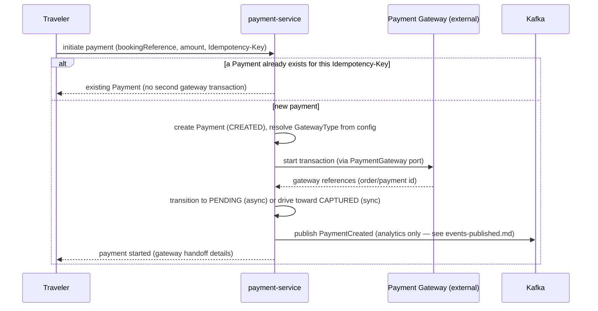
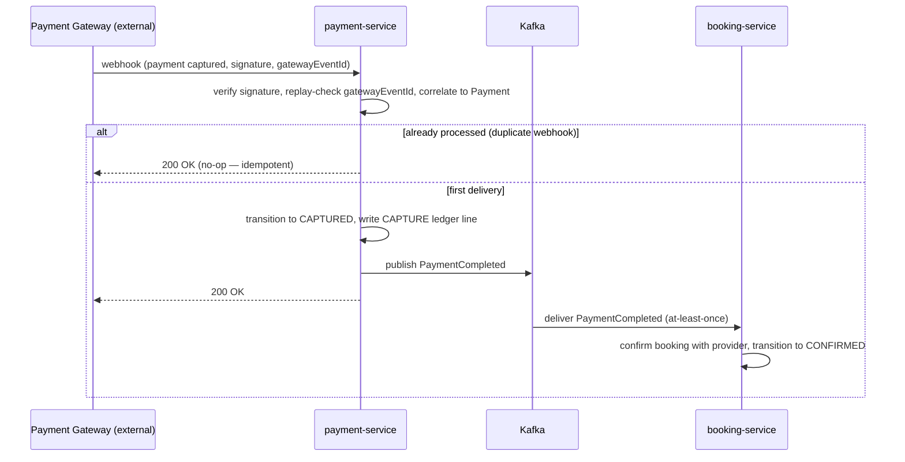
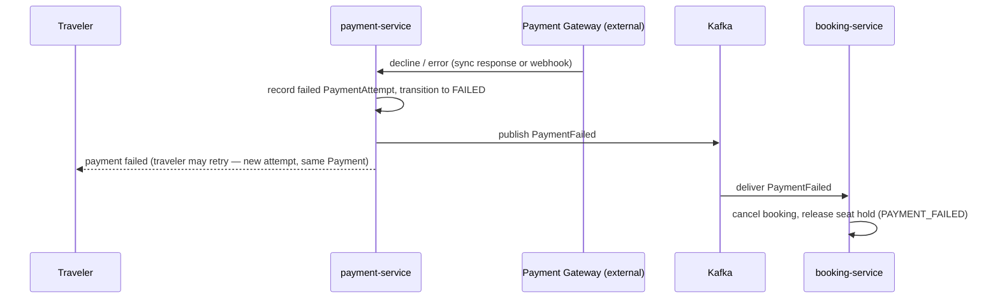
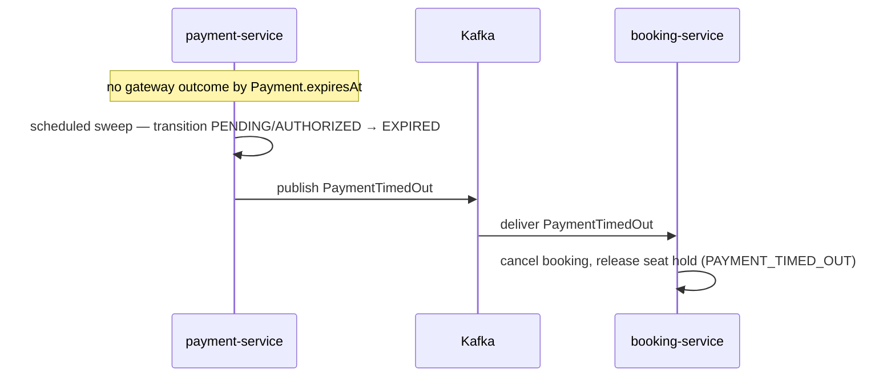
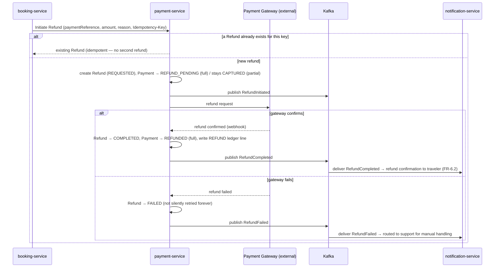

# Payment Service — Sequence Diagrams

Six flows: payment initiation, payment success (webhook), payment failure, payment timeout, late
success after timeout (the required reconciliation edge case), and refund. Each corresponds to a row
in `use-cases.md` and drives transitions in `payment-state-machine.md`. The gateway is always
reached through the `PaymentGateway` port — no diagram names Razorpay/Stripe/Adyen, because the
domain never knows which is in use (`domain-model.md`'s "Payment Gateway Abstraction").

## 1. Payment Initiation



`PaymentCreated` is analytics-only and carries no correctness weight — see `overview.md`'s Conflict
2 and `events-published.md`. For synchronous methods (immediate card capture) the flow continues
into diagram 2 without a separate webhook; for asynchronous methods (UPI, some wallets) the traveler
completes payment at the gateway and the outcome arrives as a webhook.

## 2. Payment Success (Webhook → Capture)



`PaymentCompleted` is the frozen event name `booking-service` consumes
(`docs/services/booking-service/events-consumed.md`) — **not** the brief's `PaymentSucceeded`
(`overview.md`'s Conflict 1). A duplicate capture webhook is a no-op via `gatewayEventId`
de-duplication (`domain-model.md`'s "Idempotency Strategy"), so `PaymentCompleted` is emitted
exactly once. What `booking-service` does on `PaymentCompleted` — including the provider-confirmation
edge case — is `docs/services/booking-service/sequence-diagrams.md` flow 4, not repeated here.

## 3. Payment Failure



A retry by the traveler is a **new `PaymentAttempt` on the same `Payment`**, valid while the
booking's seat hold survives (`docs/architecture/payment-flow.md`'s "Failure";
`domain-model.md`'s "Retry & Timeout Strategy"). A `CANCELLED` payment (voided before capture)
follows this same shape — it also emits `PaymentFailed`, so `booking-service` cancels the booking
and releases the seat (`domain-model.md`'s `PaymentStatus` mapping).

## 4. Payment Timeout



`PaymentTimedOut` is a frozen event the brief's event list omitted but `event-catalog.md` requires
(`overview.md`'s Conflict 3) — added back here, exactly as `booking-service` added back the frozen
`COMPLETED` state its own brief omitted. The distinct `EXPIRED`/`PaymentTimedOut` (vs.
`FAILED`/`PaymentFailed`) is kept because a late gateway confirmation is still physically possible —
diagram 5.

## 5. Late Success After Timeout (Required Reconciliation Edge Case)

```mermaid
sequenceDiagram
    participant PG as Payment Gateway (external)
    participant PS as payment-service
    participant K as Kafka
    participant BS as booking-service

    Note over PS: Payment already EXPIRED (diagram 4); booking already CANCELLED
    PG->>PS: late webhook (payment captured)
    PS->>PS: verify + correlate; record CAPTURED for financial accuracy (money moved)
    PS->>PS: write CAPTURE ledger line
    PS->>K: publish PaymentCompleted
    K->>BS: deliver PaymentCompleted for an already-CANCELLED booking
    BS->>BS: automatic refund + supportFlagged (never silent keep-the-money)
    BS->>PS: Initiate Refund (booking-service-computed amount)
    PS->>PS: create Refund, transition Payment → REFUND_PENDING
    PS->>PG: refund
    PG-->>PS: refund confirmed (webhook)
    PS->>PS: Refund → COMPLETED, Payment → REFUNDED
    PS->>K: publish RefundCompleted
```

This is `docs/architecture/payment-flow.md`'s explicitly-required edge case — *"the money did move...
this must trigger an automatic refund and a support-visible flag, never a silent 'keep the money'
outcome... a required reconciliation path, not a rare exception to hand-wave."* `payment-service`
honors the money movement truthfully (records `CAPTURED`, emits `PaymentCompleted`); `booking-service`
detects the already-cancelled booking and requests the refund back through the ordinary `Initiate
Refund` path. The symmetric case on the booking side (provider confirmation failing after payment
succeeded) is `docs/services/booking-service/sequence-diagrams.md` flow 4's `else` branch — it too
comes back to `payment-service` as an ordinary `Initiate Refund`.

## 6. Refund



Structurally identical to `docs/architecture/payment-flow.md`'s "Refund Handling" diagram, expanded
with the idempotency guard and the ledger line. The authoritative trigger is this **synchronous
`Initiate Refund` call**, not the `BookingCancelled` event — see `boundaries.md`'s "the Refund
Trigger, Reconciled." A `RefundFailed` **routes to support** and is not auto-retried indefinitely
(`docs/architecture/payment-flow.md`: *"a failed refund is not silently retried forever... routes to
support... because a stuck refund is a customer-trust issue that needs a human"*).
