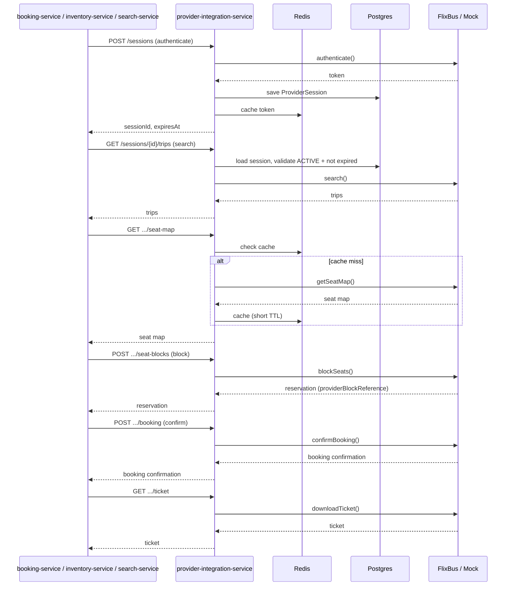
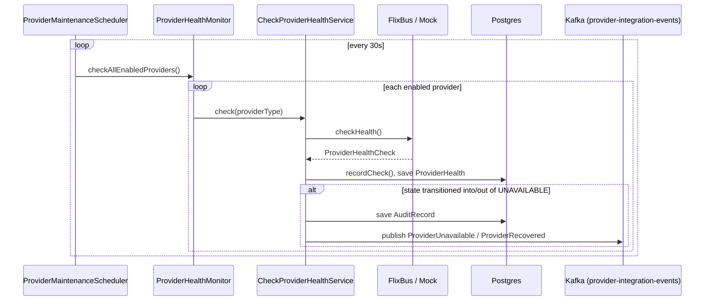

# Sequence Diagrams

## Full Provider Interaction (Mock or FlixBus — identical shape either way)

## Scheduled Health Monitoring

**Failure isolation:** one provider's probe throwing an unexpected exception does not stop the
sweep for the remaining providers — see `ProviderHealthMonitor`'s Javadoc.
