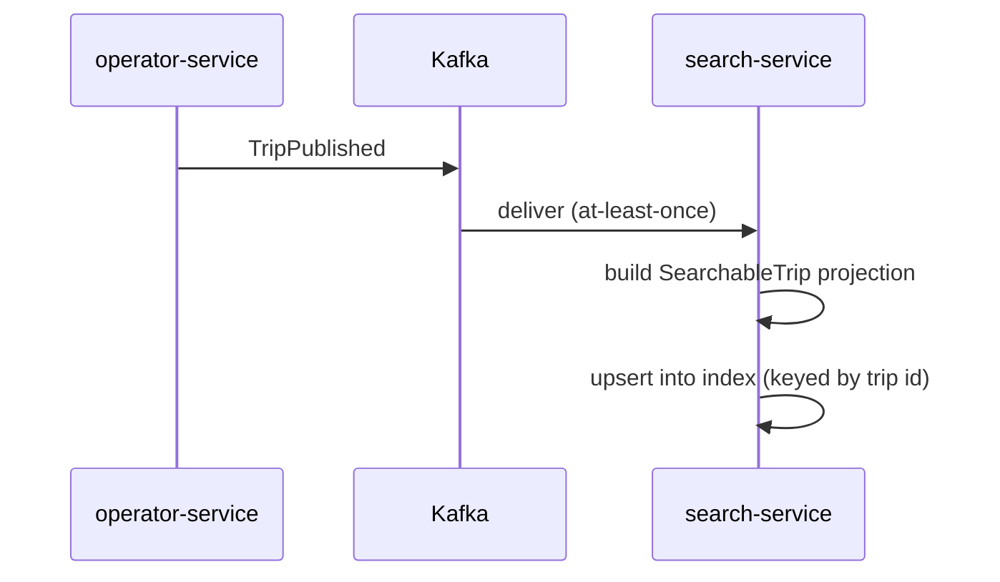
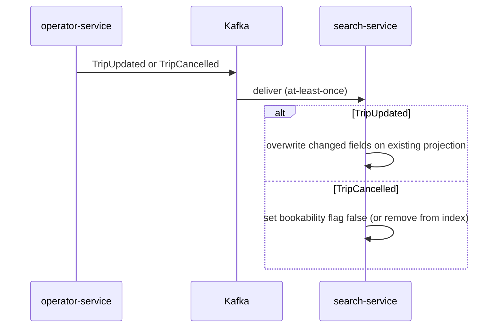
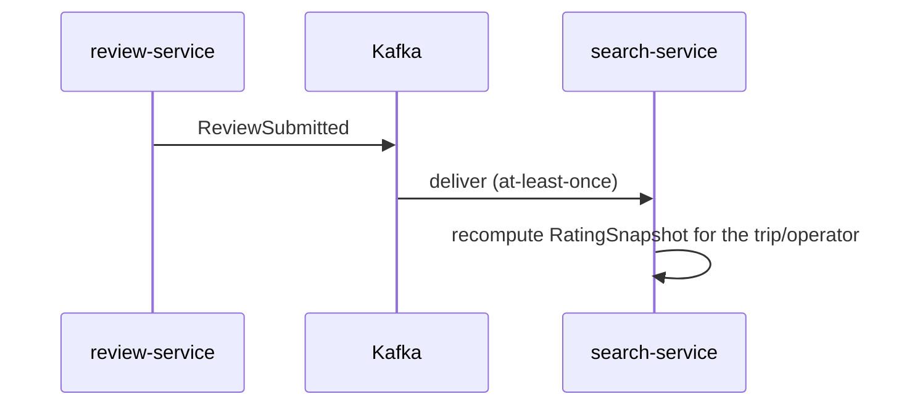
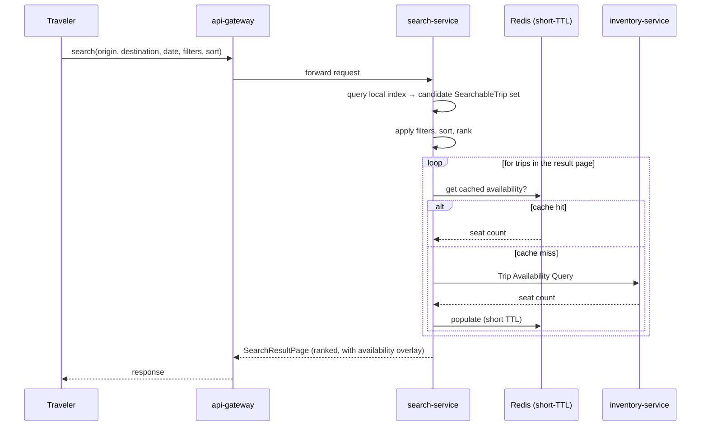

# Search Service — Sequence Diagrams

Four flows: three index-maintenance flows (one per event `search-service` consumes) and the one client-facing query flow that reads what they've built. See `use-cases.md` for the use case each diagram implements, and `boundaries.md` for the reasoning behind the two-speed design the query flow depends on.

## 1. Trip Published → Indexed

If `search-service` is behind on this topic, the trip is simply not yet searchable — no data is lost or corrupted; it becomes searchable as soon as the consumer catches up (matching `docs/architecture/event-catalog.md`'s general failure-handling model). The upsert is keyed by trip id specifically so a redelivered `TripPublished` is a harmless overwrite, not a duplicate row.

## 2. Trip Updated / Cancelled → Index Reflects It

Both branches are idempotent: a repeated `TripUpdated` re-applies the same field values, and a repeated `TripCancelled` against an already-flagged trip is a no-op — required because Kafka delivery here is at-least-once, and `search-service` cannot assume otherwise (`events-consumed.md`).

## 3. Review Submitted → Rating Snapshot Updated

Search never fetches review text — only the aggregate rating this event carries enough information to recompute (`domain-model.md`). No latency or consistency pressure here (`docs/architecture/event-catalog.md`: "reviews are not on any latency- or consistency-critical path").

## 4. Traveler Searches Trips (the client-facing query path)

This is the one place `search-service` makes a synchronous call to another service. It is deliberately scoped to overlay a per-trip **count**, never seat-level detail, and it degrades rather than fails: if `inventory-service` or the cache is unreachable, results are still returned with availability marked unknown rather than the whole search failing (`boundaries.md`'s "degrade, not fail" rule — the opposite of `docs/architecture/seat-locking-flow.md`'s "fail closed" rule for the hold path, because this path protects no correctness guarantee, only a display nicety).
